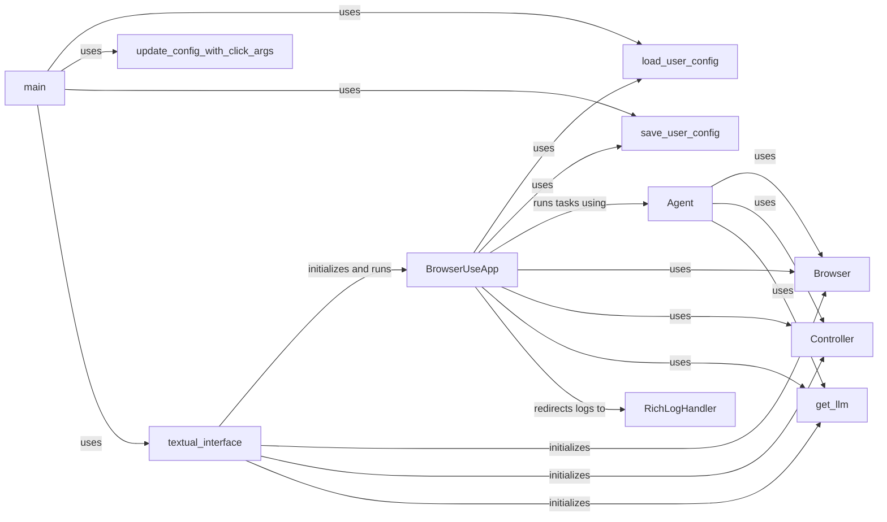

## Component Details

### BrowserUseApp
The main Textual application class that orchestrates the browser automation and interaction with the LLM. It manages the UI, user input, task execution, and display of information. It initializes and manages the Browser, Controller, and LLM components. It also handles user input, displays agent output, and manages the application's configuration.
- **Related Classes/Methods**: `browser_use.cli`

### Browser
A class responsible for managing the browser instance (e.g., Chrome, Firefox) and handling browser-related actions like navigation and content extraction. It is initialized with a BrowserConfig and used by the Agent to perform actions in the browser.
- **Related Classes/Methods**: `browser_use.cli`

### Controller
A class that provides an interface for controlling the browser, likely handling user interactions and managing the browser's state. It is used by the Agent to interact with the browser.
- **Related Classes/Methods**: `browser_use.cli`

### Agent
A class that encapsulates the logic for executing tasks using the LLM and browser. It interacts with the LLM to generate actions and the browser to perform them. It also manages the task history and state.
- **Related Classes/Methods**: `browser_use.cli`

### get_llm
A function that initializes and returns a language model (LLM) based on the configuration and available API keys. It supports OpenAI, Anthropic, and Google models. The Agent uses it to generate actions.
- **Related Classes/Methods**: `browser_use.cli`

### load_user_config
A function that loads the user configuration from a JSON file (`~/.browser_use.json`). If the file doesn't exist, it creates a default configuration. The BrowserUseApp loads the configuration at startup.
- **Related Classes/Methods**: `browser_use.cli`

### save_user_config
A function that saves the user configuration to a JSON file (`~/.browser_use.json`). The BrowserUseApp saves the configuration when it changes.
- **Related Classes/Methods**: `browser_use.cli`

### update_config_with_click_args
A function that updates the configuration dictionary with values provided as command-line arguments using `click`. It allows users to configure the application via command line.
- **Related Classes/Methods**: `browser_use.cli`

### RichLogHandler
A custom logging handler that redirects log messages to a Textual RichLog widget, allowing the application to display logs within the UI. It captures log messages from different components and displays them in the UI.
- **Related Classes/Methods**: `browser_use.cli`

### textual_interface
A function that sets up and runs the Textual UI, initializing the Browser, Controller, and LLM components before launching the application. It orchestrates the initialization of the application.
- **Related Classes/Methods**: `browser_use.cli`
