```mermaid
graph LR
    CLI_Entry_Point["CLI Entry Point"]
    Textual_UI_Application["Textual UI Application"]
    Agent_Service["Agent Service"]
    Browser_Session["Browser Session"]
    Controller_Service["Controller Service"]
    CLI_Entry_Point -- "launches" --> Textual_UI_Application
    CLI_Entry_Point -- "loads configuration for" --> Textual_UI_Application
    Textual_UI_Application -- "runs task via" --> Agent_Service
    Agent_Service -- "manages" --> Browser_Session
    Agent_Service -- "interacts with" --> Controller_Service
    Controller_Service -- "manages interaction for" --> Browser_Session
    click CLI_Entry_Point href "https://github.com/CodeBoarding/GeneratedOnBoardings/blob/main/browser-use/CLI Entry Point.md" "Details"
    click Textual_UI_Application href "https://github.com/CodeBoarding/GeneratedOnBoardings/blob/main/browser-use/Textual UI Application.md" "Details"
    click Agent_Service href "https://github.com/CodeBoarding/GeneratedOnBoardings/blob/main/browser-use/Agent Service.md" "Details"
    click Browser_Session href "https://github.com/CodeBoarding/GeneratedOnBoardings/blob/main/browser-use/Browser Session.md" "Details"
    click Controller_Service href "https://github.com/CodeBoarding/GeneratedOnBoardings/blob/main/browser-use/Controller Service.md" "Details"
```

## Component Details

The User Interface component provides the entry point for users to interact with the browser automation system. It encompasses the command-line interface (CLI) built with Click and the Textual-based GUI. The CLI handles loading and saving user configurations, while the Textual application manages the UI, task execution, and interaction with the agent and browser. The main flow involves loading user configuration, presenting the UI, accepting user input to define tasks, executing those tasks via the agent, and displaying the results to the user.

### CLI Entry Point
The CLI entry point (`browser-use.browser_use.cli`) is responsible for parsing command-line arguments, loading user configuration, and launching the Textual interface. It uses Click to define the command-line interface and handles updating the configuration based on command-line arguments. It also manages saving the configuration after the application runs.
- **Related Classes/Methods**: `browser-use.browser_use.cli:load_user_config`, `browser-use.browser_use.cli:get_default_config`, `browser-use.browser_use.cli:save_user_config`, `browser-use.browser_use.cli:update_config_with_click_args`, `browser-use.browser_use.cli:main`, `browser-use.browser_use.cli:textual_interface`

### Textual UI Application
The `BrowserUseApp` class (`browser-use.browser_use.cli.BrowserUseApp`) represents the Textual application. It sets up logging, manages the layout of the UI with panels for browser display, model output, and task status. It handles user input via key presses and input submission, triggering task execution and updating the UI to reflect the current state of the browser and agent.
- **Related Classes/Methods**: `browser-use.browser_use.cli.BrowserUseApp:setup_richlog_logging`, `browser-use.browser_use.cli.BrowserUseApp:on_mount`, `browser-use.browser_use.cli.BrowserUseApp:on_key`, `browser-use.browser_use.cli.BrowserUseApp:on_input_submitted`, `browser-use.browser_use.cli.BrowserUseApp:update_info_panels`, `browser-use.browser_use.cli.BrowserUseApp:run_task`, `browser-use.browser_use.cli.BrowserUseApp:action_quit`, `browser-use.browser_use.cli.BrowserUseApp:hide_intro_panels`, `browser-use.browser_use.cli.BrowserUseApp.update_browser_panel`, `browser-use.browser_use.cli.BrowserUseApp.update_model_panel`, `browser-use.browser_use.cli.BrowserUseApp.update_tasks_panel`

### Agent Service
The `Agent` service (`browser_use.agent.service.Agent`) is responsible for managing and running tasks. It receives tasks from the UI, interacts with the browser session and controller to execute them, and returns the results. It handles task queuing and execution, coordinating the interaction between the browser and the language model.
- **Related Classes/Methods**: `browser_use.agent.service.Agent`, `browser_use.agent.service.Agent.add_new_task`, `browser_use.agent.service.Agent.run`

### Browser Session
The `BrowserSession` (`browser_use.browser.session.BrowserSession`) component manages the browser instance. It provides methods for navigating to URLs, interacting with web elements, and retrieving information from the browser. It is initialized and closed by the UI and used by the agent to execute tasks.
- **Related Classes/Methods**: `browser_use.browser.session.BrowserSession`, `browser_use.browser.session.BrowserSession.close`

### Controller Service
The `Controller` service (`browser_use.controller.service.Controller`) manages the interaction between the agent and the browser. It handles task scheduling, resource allocation, and error handling. It receives instructions from the agent and translates them into browser actions.
- **Related Classes/Methods**: `browser_use.controller.service.Controller`