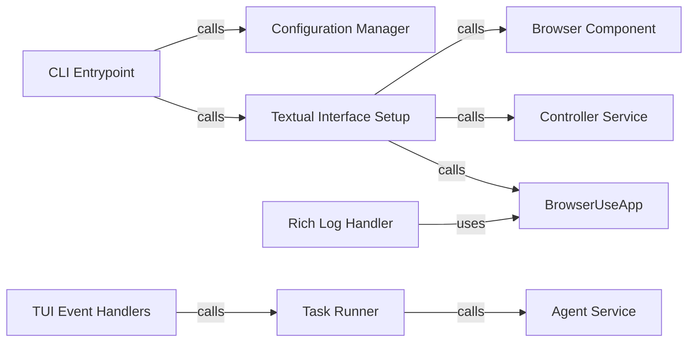

## Component Details

The User Interface component provides a way for users to interact with the Browser Use application. It encompasses both a Command Line Interface (CLI) and a Textual User Interface (TUI). The CLI handles configuration loading, updating, and saving, while the TUI provides a visual interface for monitoring and controlling the agent's progress. Users can input tasks, view agent actions, and monitor the browser state through the TUI.

### CLI Entrypoint
The `browser_use.cli:main` function serves as the entry point for the command-line interface. It orchestrates the loading of user configurations, updates these configurations based on command-line arguments, saves the updated configuration, and then initiates the Textual User Interface (TUI).
- **Related Classes/Methods**: `browser-use.browser_use.cli`

### Configuration Manager
This component, consisting of `browser_use.cli:load_user_config` and `browser_use.cli:save_user_config`, handles the loading and saving of user configurations. It loads configurations from a file, or defaults if the file doesn't exist, and saves updated configurations back to the file.
- **Related Classes/Methods**: `browser-use.browser_use.cli`

### Textual Interface Setup
The `browser_use.cli:textual_interface` function is responsible for setting up and running the Textual User Interface (TUI). It initializes the Browser, Controller, and BrowserUseApp components, effectively launching the TUI application.
- **Related Classes/Methods**: `browser-use.browser_use.cli`

### BrowserUseApp
The `browser_use.cli.BrowserUseApp` class is the core of the Textual User Interface (TUI). It manages user input, updates the display, and orchestrates task execution. It contains the main layout and functionality of the TUI, providing a visual representation of the application's state and allowing users to interact with it.
- **Related Classes/Methods**: `browser-use.browser_use.cli`

### TUI Event Handlers
This component includes `browser_use.cli.BrowserUseApp:on_mount` and `browser_use.cli.BrowserUseApp:on_input_submitted`. `on_mount` sets up the rich logging and updates the info panels when the application is mounted. `on_input_submitted` handles user input submitted through the Textual interface, saves the user configuration, and initiates task execution.
- **Related Classes/Methods**: `browser-use.browser_use.cli`

### Task Runner
The `browser_use.cli.BrowserUseApp:run_task` function is responsible for running tasks using the agent service. It interacts with the Agent to add and run the task, updating the info panels and hiding the intro panels.
- **Related Classes/Methods**: `browser-use.browser_use.cli`

### Rich Log Handler
The `browser_use.cli.RichLogHandler` is a custom logging handler that redirects logs to a RichLog widget within the Textual UI. This enables the application to display logs directly within the TUI, providing real-time feedback on the application's operations.
- **Related Classes/Methods**: `browser-use.browser_use.cli`

### Browser Component
The `browser_use.browser.browser.Browser` component is responsible for interacting with the web browser. It provides the functionality for the agent to perform tasks within the browser environment.
- **Related Classes/Methods**: `browser-use.browser.browser`

### Controller Service
The `browser_use.controller.service.Controller` service provides control and coordination between the agent and the browser. It manages the interaction between these two components, ensuring smooth task execution.
- **Related Classes/Methods**: `browser-use.controller.service`

### Agent Service
The `browser_use.agent.service.Agent` service is responsible for managing and running tasks. It interacts with the browser and controller components to execute tasks and achieve the desired outcome.
- **Related Classes/Methods**: `browser-use.agent.service`
