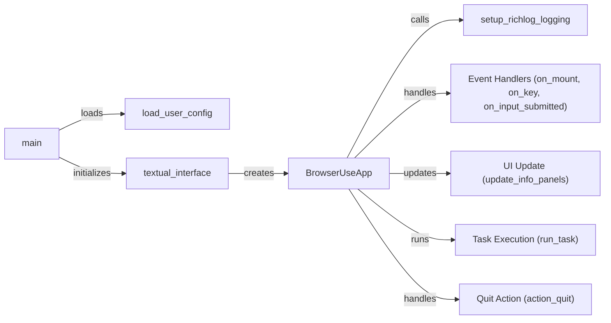

## Component Details

The User Interface component provides a command-line interface for users to interact with the BrowserUse application. It initializes the application, loads user configurations, sets up logging, manages the textual UI, handles user input, executes tasks, and updates the UI with real-time feedback. The component uses Textual to create a rich terminal UI, allowing users to monitor and control the automated browsing process.

### BrowserUseApp
The main application class, extending Textual's App, manages the textual interface, user interactions, and task execution. It initializes the UI, sets up logging using `setup_richlog_logging`, and defines event handlers for user input, such as `on_mount`, `on_key`, and `on_input_submitted`. It also includes methods for updating the UI (`update_info_panels`), running tasks (`run_task`), and handling the quit action (`action_quit`).
- **Related Classes/Methods**: `browser_use.cli.BrowserUseApp`

### load_user_config
This component is responsible for loading the user configuration from a specified file or using default settings. The configuration dictates the application's behavior, including task definitions and browser settings. It ensures that the application starts with the correct parameters and task specifications.
- **Related Classes/Methods**: `browser_use.cli:load_user_config`

### setup_richlog_logging
Configures rich logging for the application, enabling detailed logging of events and errors to a file. This aids in debugging and monitoring the application's behavior by providing a comprehensive record of application events.
- **Related Classes/Methods**: `browser_use.cli.BrowserUseApp:setup_richlog_logging`

### Event Handlers (on_mount, on_key, on_input_submitted)
These event handlers manage user interactions and application lifecycle events. `on_mount` performs initial UI setup, `on_key` handles key presses (e.g., 'q' to quit), and `on_input_submitted` processes user input to initiate actions.
- **Related Classes/Methods**: `browser_use.cli.BrowserUseApp:on_mount`, `browser_use.cli.BrowserUseApp:on_key`, `browser_use.cli.BrowserUseApp:on_input_submitted`

### UI Update (update_info_panels)
Updates the information panels in the UI with relevant data, such as task status and browser information. This provides real-time feedback to the user, allowing them to monitor the progress and state of the application.
- **Related Classes/Methods**: `browser_use.cli.BrowserUseApp:update_info_panels`

### Task Execution (run_task)
Executes a specific task based on user input or configuration. This involves interacting with the browser automation component to perform actions such as navigating to URLs and filling out forms. It is the core functionality for automating browser interactions.
- **Related Classes/Methods**: `browser_use.cli.BrowserUseApp:run_task`

### Quit Action (action_quit)
Handles the quit action of the application, gracefully shutting down the UI and any running tasks. This ensures a clean exit from the application, preventing any resource leaks or incomplete operations.
- **Related Classes/Methods**: `browser_use.cli.BrowserUseApp:action_quit`

### textual_interface
Sets up the Textual interface and initializes the BrowserUseApp. This function is responsible for creating the application instance and starting the Textual event loop, which drives the UI and handles user interactions.
- **Related Classes/Methods**: `browser_use.cli:textual_interface`

### main
The main entry point of the application. It parses command-line arguments, loads the user configuration using `load_user_config`, sets up the textual interface using `textual_interface`, and starts the application. It orchestrates the initial setup and execution of the application.
- **Related Classes/Methods**: `browser_use.cli:main`
