```mermaid
graph LR
    Configuration_Management["Configuration Management"]
    Textual_Interface_Setup["Textual Interface Setup"]
    BrowserUseApp_Lifecycle["BrowserUseApp Lifecycle"]
    Task_Execution["Task Execution"]
    Information_Panel_Updates["Information Panel Updates"]
    Main_Entry_Point["Main Entry Point"]
    Logging_Setup["Logging Setup"]
    Agent_Service_Interaction["Agent Service Interaction"]
    Browser_Session_Management["Browser Session Management"]
    Controller_Service_Interaction["Controller Service Interaction"]
    Configuration_Management -- "loads configuration from" --> Main_Entry_Point
    Configuration_Management -- "saves configuration to" --> Main_Entry_Point
    Textual_Interface_Setup -- "initializes" --> Browser_Session_Management
    Textual_Interface_Setup -- "initializes" --> Controller_Service_Interaction
    Logging_Setup -- "sets up logging using" --> Textual_Interface_Setup
    BrowserUseApp_Lifecycle -- "is called by" --> Textual_Interface_Setup
    Task_Execution -- "calls" --> Agent_Service_Interaction
    Task_Execution -- "calls" --> Information_Panel_Updates
    Main_Entry_Point -- "calls" --> Configuration_Management
    Main_Entry_Point -- "calls" --> Textual_Interface_Setup
    BrowserUseApp_Lifecycle -- "is called by" --> Task_Execution
    BrowserUseApp_Lifecycle -- "calls" --> Configuration_Management
    Textual_Interface_Setup -- "calls" --> Browser_Session_Management
    Textual_Interface_Setup -- "calls" --> Controller_Service_Interaction
    click Configuration_Management href "https://github.com/CodeBoarding/GeneratedOnBoardings/blob/main/browser-use/Configuration Management.md" "Details"
    click Textual_Interface_Setup href "https://github.com/CodeBoarding/GeneratedOnBoardings/blob/main/browser-use/Textual Interface Setup.md" "Details"
    click BrowserUseApp_Lifecycle href "https://github.com/CodeBoarding/GeneratedOnBoardings/blob/main/browser-use/BrowserUseApp Lifecycle.md" "Details"
    click Task_Execution href "https://github.com/CodeBoarding/GeneratedOnBoardings/blob/main/browser-use/Task Execution.md" "Details"
    click Information_Panel_Updates href "https://github.com/CodeBoarding/GeneratedOnBoardings/blob/main/browser-use/Information Panel Updates.md" "Details"
    click Main_Entry_Point href "https://github.com/CodeBoarding/GeneratedOnBoardings/blob/main/browser-use/Main Entry Point.md" "Details"
    click Logging_Setup href "https://github.com/CodeBoarding/GeneratedOnBoardings/blob/main/browser-use/Logging Setup.md" "Details"
    click Agent_Service_Interaction href "https://github.com/CodeBoarding/GeneratedOnBoardings/blob/main/browser-use/Agent Service Interaction.md" "Details"
    click Browser_Session_Management href "https://github.com/CodeBoarding/GeneratedOnBoardings/blob/main/browser-use/Browser Session Management.md" "Details"
    click Controller_Service_Interaction href "https://github.com/CodeBoarding/GeneratedOnBoardings/blob/main/browser-use/Controller Service Interaction.md" "Details"
```

## Component Details

The User Interface component provides the primary means for users to interact with the browser automation system. It encompasses both the command-line interface (CLI) and the Textual UI. The UI handles loading and saving configurations, setting up logging, managing the textual interface, handling user input, running tasks, and updating information panels. It interacts with the Agent service to add and run tasks, and with the BrowserSession and Controller to manage the browser interaction and overall workflow.

### Configuration Management
This component is responsible for loading and saving user configurations. It loads the user configuration from a file or uses default settings, and saves the user configuration to a file. It interacts with the main entry point of the application to load and save configurations.
- **Related Classes/Methods**: `browser-use.browser_use.cli:load_user_config`, `browser-use.browser_use.cli:save_user_config`

### Textual Interface Setup
This component sets up the textual interface using the Textual library. It initializes the BrowserSession, Controller, and BrowserUseApp, and sets up logging. It interacts with the BrowserSession and Controller to manage the browser interaction and overall workflow.
- **Related Classes/Methods**: `browser-use.browser_use.cli:textual_interface`

### BrowserUseApp Lifecycle
This component manages the lifecycle of the BrowserUseApp, including mounting, handling key presses, and handling user input. It sets up rich logging, updates the information panels, and runs tasks based on user input.
- **Related Classes/Methods**: `browser-use.browser_use.cli.BrowserUseApp:on_mount`, `browser-use.browser_use.cli.BrowserUseApp:on_key`, `browser-use.browser_use.cli.BrowserUseApp:on_input_submitted`

### Task Execution
This component is responsible for running tasks based on user input. It hides the intro panels, updates the information panels, and interacts with the Agent service to add and run the task.
- **Related Classes/Methods**: `browser-use.browser_use.cli.BrowserUseApp:run_task`

### Information Panel Updates
This component updates the information panels in the textual interface. It updates the browser, model, and tasks panels.
- **Related Classes/Methods**: `browser-use.browser_use.cli.BrowserUseApp:update_info_panels`

### Main Entry Point
This component is the main entry point of the application. It loads user configuration, updates it with command-line arguments, saves the configuration, and starts the textual interface.
- **Related Classes/Methods**: `browser-use.browser_use.cli:main`

### Logging Setup
This component sets up logging for the application. It configures a custom formatter and adds a logging level.
- **Related Classes/Methods**: `browser-use.browser_use.logging_config:setup_logging`, `browser-use.browser_use.cli.BrowserUseApp:setup_richlog_logging`

### Agent Service Interaction
This component interacts with the Agent service to add and run tasks. It provides methods for adding new tasks and running them.
- **Related Classes/Methods**: `browser-use.agent.service.Agent`

### Browser Session Management
This component manages the browser session, including initialization and closing.
- **Related Classes/Methods**: `browser_use.browser.session.BrowserSession`

### Controller Service Interaction
This component controls the browser interaction and manages the overall workflow.
- **Related Classes/Methods**: `browser_use.controller.service.Controller`