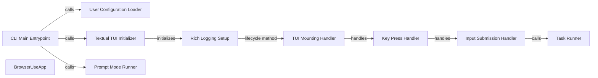

## Component Details

The User Interface component provides the primary means for users to interact with the browser automation system. It initializes the application, handles user input through a Textual TUI or command-line prompts, manages task execution, and displays progress and status updates to the user. The component leverages the `textual` library for creating a rich command-line interface.

### CLI Main Entrypoint
The `main` function in `cli.py` serves as the application's entry point. It parses command-line arguments, loads user configurations, and determines whether to launch the Textual TUI or run the application in prompt mode. It orchestrates the initial setup and mode selection based on user input and configuration.
- **Related Classes/Methods**: `browser_use/browser_use/cli.py`

### User Configuration Loader
The `load_user_config` function is responsible for loading user-defined settings and preferences from a configuration file. These settings influence the behavior of the browser automation system, such as default browser settings or task-specific parameters. This component ensures that the application respects user preferences.
- **Related Classes/Methods**: `browser_use/browser_use/cli.py`

### Textual TUI Initializer
The `textual_interface` function initializes and runs the Textual TUI. This function sets up the visual interface, enabling users to interact with the application through a graphical command-line environment. It is responsible for creating and launching the `BrowserUseApp` instance.
- **Related Classes/Methods**: `browser_use/browser_use/cli.py`

### BrowserUseApp
The `BrowserUseApp` class, inheriting from `textual.app.App`, is the core of the Textual TUI. It defines the layout, handles user input (keyboard and input submission), manages task execution, and updates the information displayed in the TUI. It acts as the central controller for the TUI.
- **Related Classes/Methods**: `browser_use/browser_use/cli.py`

### Rich Logging Setup
The `setup_richlog_logging` function configures logging using the `rich` library. This provides structured and visually appealing logs, which are essential for debugging, monitoring, and understanding the application's behavior. It enhances the user experience by providing informative and readable logs.
- **Related Classes/Methods**: `browser_use/browser_use/cli.py`

### TUI Mounting Handler
The `on_mount` method is a Textual TUI lifecycle method that is automatically called when the application is mounted. It initializes the user interface elements, sets up the initial state of the TUI, and performs any necessary setup tasks before the user interface becomes interactive.
- **Related Classes/Methods**: `browser_use/browser_use/cli.py`

### Key Press Handler
The `on_key` method handles key presses within the TUI. It allows the user to interact with the application using the keyboard, triggering specific actions based on the keys pressed. This component enables keyboard navigation and shortcuts within the TUI.
- **Related Classes/Methods**: `browser_use/browser_use/cli.py`

### Input Submission Handler
The `on_input_submitted` method handles the submission of user input within the TUI. It is triggered when the user presses Enter after typing in a command or query. This component processes the user's input and initiates the corresponding task or action.
- **Related Classes/Methods**: `browser_use/browser_use/cli.py`

### Task Runner
The `run_task` method executes a specific task based on user input or configuration. This is the core functionality of the application, where the browser interaction actually happens. It orchestrates the steps required to complete the task and updates the TUI with progress and status information.
- **Related Classes/Methods**: `browser_use/browser_use/cli.py`

### Prompt Mode Runner
The `run_prompt_mode` function runs the application in prompt mode, providing an interactive command-line interface. This mode allows users to directly enter commands and interact with the browser automation system without using the TUI.
- **Related Classes/Methods**: `browser_use/browser_use/cli.py`