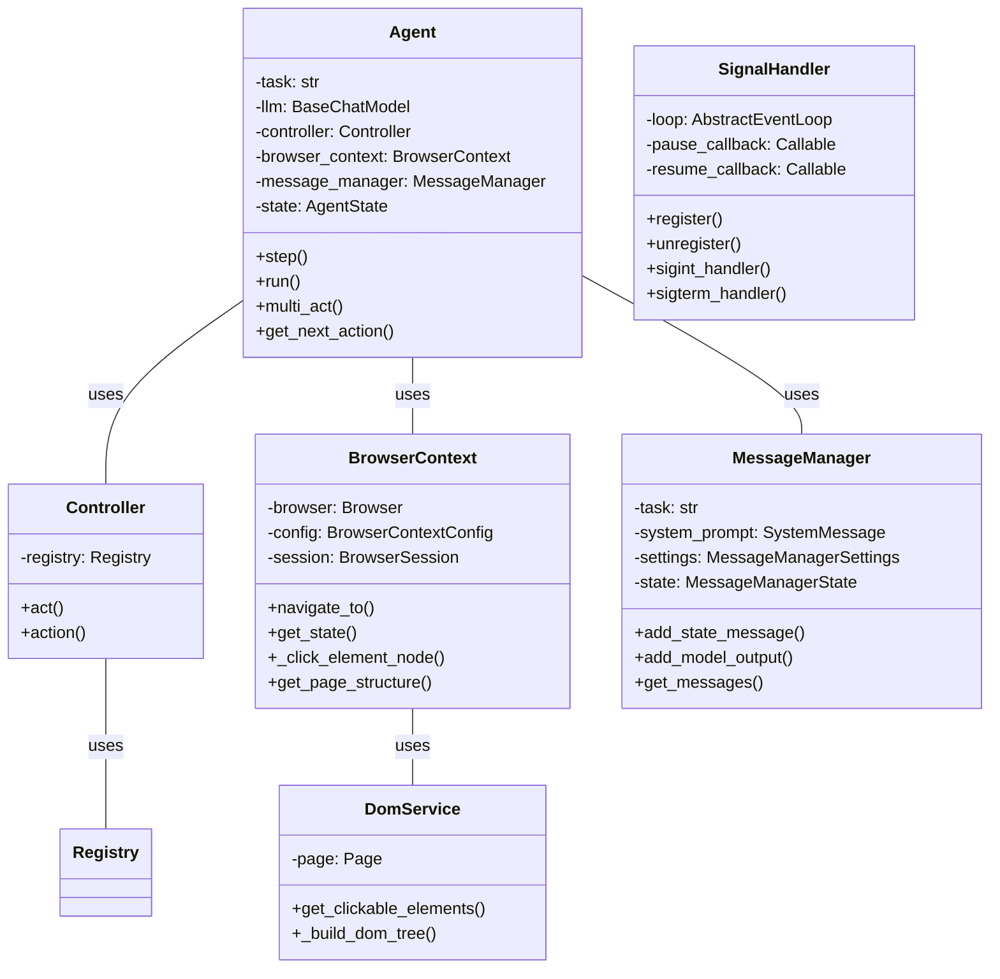

Okay, I have analyzed the source code of the core components. Here's a refined overview of the `browser-use` component:

**Component Description:**

The `browser-use` component provides an automated browsing capability, allowing an agent to interact with web pages programmatically. It combines a browser context, a DOM representation, and a controller to execute actions based on instructions, typically from a Large Language Model (LLM). The core functionality includes navigating web pages, extracting content, interacting with DOM elements (clicking, inputting text), and managing browser state.

**Main Classes and Their Purposes:**

*   **`Agent`**: The orchestrator. It plans steps, uses the `Controller` to execute actions, and manages the agent's state and memory. It uses an LLM to decide on the next action.
*   **`BrowserContext`**: Manages a single browser session. It handles navigation, page state, and interactions with web elements. It uses Playwright under the hood.
*   **`Controller`**: Executes actions on the browser based on instructions from the `Agent`. It uses an `ActionRegistry` to find and execute the appropriate action.
*   **`DomService`**: Responsible for extracting, processing, and representing the Document Object Model (DOM) of a web page. It builds a tree structure of the DOM and identifies clickable elements.
*   **`MessageManager`**: Manages the messages exchanged between the agent and the LLM, including system prompts, user inputs, and model outputs. It also handles token counting and message trimming to stay within the LLM's context window.
*   **`SignalHandler`**: Handles signals like Ctrl+C for pausing and resuming the agent.

**Visualization:**

I will use a class diagram to represent the structure of the component, highlighting the main classes and their relationships.

