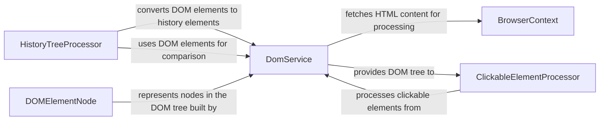

## Component Details

The Web Content Processing component is responsible for extracting and processing the Document Object Model (DOM) of web pages. It retrieves the page's HTML content and structure, parses the HTML into a DOM tree, identifies clickable elements, and handles cross-origin iframes. It enables the system to understand and interact with the structure of web pages, facilitating targeted actions and information extraction. The main flow involves the BrowserContext fetching the HTML, the DomService parsing it into a DOM tree, the ClickableElementProcessor identifying clickable elements, and the HistoryTreeProcessor managing the history of DOM changes.

### BrowserContext
The BrowserContext component interacts with the browser to retrieve the page's HTML content and structure. It provides methods to get the page's HTML, the page structure as a DOM tree, and specific DOM elements by index.
- **Related Classes/Methods**: `browser_use.browser.context.BrowserContext`

### DomService
The DomService component parses the HTML content into a DOM tree structure and extracts clickable elements from it. It builds the DOM tree, parses individual nodes, and identifies cross-origin iframes.
- **Related Classes/Methods**: `browser_use.dom.service.DomService`

### DOMElementNode
The DOMElementNode component represents a node in the DOM tree. It provides methods to extract all text until the next clickable element and convert clickable elements to a string representation.
- **Related Classes/Methods**: `browser_use.dom.views.DOMElementNode`

### ClickableElementProcessor
The ClickableElementProcessor component identifies and processes clickable elements within the DOM tree. It extracts clickable elements and calculates their hashes based on attributes, XPath, and text content.
- **Related Classes/Methods**: `browser_use.dom.clickable_element_processor.service.ClickableElementProcessor`

### HistoryTreeProcessor
The HistoryTreeProcessor component manages the history of DOM changes. It converts DOM elements to history elements, finds history elements in the tree, compares history and DOM elements, and calculates hashes for both.
- **Related Classes/Methods**: `browser_use.dom.history_tree_processor.service.HistoryTreeProcessor`
