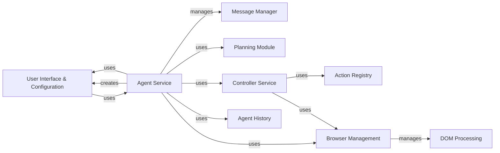

## Component Details

### User Interface & Configuration
This component provides the command-line interface for user interaction and manages application configuration. It handles user input, displays agent progress, loads/saves configurations, and updates them with command-line arguments, ensuring the application is properly set up and the user can effectively interact with the agent.
- **Related Classes/Methods**: `repos.browser-use.browser_use.cli`, `repos.browser-use.browser_use.cli.BrowserUseApp`, `repos.browser-use.browser_use.cli:load_user_config`, `repos.browser-use.browser_use.cli:get_default_config`, `repos.browser-use.browser_use.cli:save_user_config`, `repos.browser-use.browser_use.cli:update_config_with_click_args`

### Agent Service
The Agent Service manages the agent's lifecycle, including initialization, task execution, and history management. It orchestrates the interaction between the LLM, browser context, and controller. It also handles signal interruptions, ensuring the agent operates smoothly and can be gracefully stopped.
- **Related Classes/Methods**: `browser_use.agent.service.Agent`, `browser_use.agent.service`, `browser_use.agent.service.Agent:_run_planner`, `repos.browser-use.browser_use.utils.SignalHandler`

### Message Manager
The Message Manager handles the conversation history between the user and the agent. It manages message tokens, filters sensitive data, and formats messages for the LLM, ensuring effective and secure communication between the user and the agent.
- **Related Classes/Methods**: `browser_use.agent.message_manager.service.MessageManager`, `browser_use.agent.message_manager.service`, `browser_use.agent.message_manager.views`

### Planning Module
The Planning Module is responsible for generating a plan of action for the agent based on the user's task and the current browser state. It uses the LLM to create a sequence of steps to achieve the desired goal, enabling the agent to perform complex tasks effectively.
- **Related Classes/Methods**: `browser_use.agent.prompts.PlannerPrompt`

### Controller Service
The Controller Service executes actions in the browser based on the agent's plan. It interacts with the browser context to perform tasks such as clicking elements, filling forms, and navigating to URLs, enabling the agent to interact with web pages.
- **Related Classes/Methods**: `browser_use.controller.service.Controller`, `browser_use.controller.service`

### Action Registry
The Action Registry maintains a list of available actions that the agent can perform. It provides descriptions of the actions and their parameters for the LLM, ensuring the agent has access to a comprehensive set of tools for interacting with the browser.
- **Related Classes/Methods**: `browser_use.controller.registry.service.Registry`, `browser_use.controller.registry.views.ActionRegistry`

### Browser Management
This component encompasses the Browser and Browser Context, responsible for launching, managing, and interacting with the browser instance. It handles browser configuration, creates browser contexts, manages browser state (tabs, URLs, cookies), and provides an interface for interacting with the browser and extracting information, forming the foundation for browser automation.
- **Related Classes/Methods**: `browser_use.browser.browser.Browser`, `browser_use.browser.browser`, `browser_use.browser.context.BrowserContext`, `browser_use.browser.context`

### DOM Processing
The DOM Processing component extracts and processes the Document Object Model (DOM) of web pages. It builds a tree structure of the DOM, identifies clickable elements, and provides a mechanism for the agent to interact with specific elements on a web page, enabling precise interaction with web content.
- **Related Classes/Methods**: `repos.browser-use.browser_use.dom.service.DomService`, `browser_use.dom.service`, `browser_use.dom.clickable_element_processor.service.ClickableElementProcessor`

### Agent History
The Agent History component stores the history of agent actions and results, allowing for debugging, replaying, and exporting agent sessions. This provides valuable insights into agent behavior and facilitates improvements.
- **Related Classes/Methods**: `browser_use.agent.views.AgentHistory`, `browser_use.agent.views.AgentHistoryList`