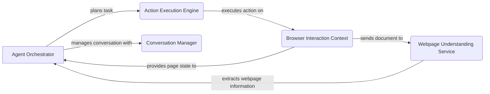

Okay, I will generate an onboarding document for the `browser-use` project based on the provided information.

**1. Project Description**

The `browser-use` project enables an agent to interact with web pages programmatically. It provides the necessary components to navigate websites, understand page structure, execute actions, and maintain a conversation history, allowing for automated browsing tasks.

**2. Data Flow Diagram**

**3. Component Descriptions**

*   **Agent Orchestrator:** This component is the brain of the system. It plans and executes browsing tasks by leveraging the other components. It decides which actions to take based on the current page state and the conversation history.

*   **Action Execution Engine:** This component acts as the intermediary between the Agent Orchestrator and the Browser Interaction Context. It receives action requests from the Agent Orchestrator and executes them on the browser.

*   **Browser Interaction Context:** This component manages the browser session and provides an interface for interacting with web pages. It handles navigation, JavaScript execution, and state retrieval.

*   **Webpage Understanding Service:** This component extracts and processes the DOM of a web page to identify clickable elements and understand the page structure. It provides the Agent Orchestrator with information about the available actions on the page.

*   **Conversation Manager:** This component handles the conversation history between the agent and the user, adding messages, filtering sensitive data, and managing token counts. It provides the Agent Orchestrator with the context needed to make informed decisions.