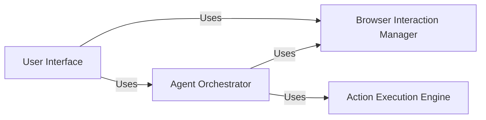

## Component Details

### Agent Orchestrator
The Agent Orchestrator is the central component responsible for managing the agent's lifecycle. It coordinates task execution, planning, and interactions between the LLM, browser, and controller services. It handles memory management, prompt engineering, and signal handling to ensure smooth and efficient operation, making it the brain of the entire system.
- **Related Classes/Methods**: `browser_use.agent.service.Agent`

### Browser Interaction Manager
The Browser Interaction Manager handles all interactions with the browser, including navigation, content extraction, and element manipulation. It provides a high-level API for the agent to interact with web pages, abstracting away the complexities of the underlying browser technology. It manages browser contexts, tabs, and DOM manipulation, acting as the interface between the agent and the web.
- **Related Classes/Methods**: `browser_use.browser.context.BrowserContext`

### Action Execution Engine
The Action Execution Engine is responsible for executing actions in the browser based on the agent's plan. It interacts with the browser context to perform tasks such as clicking elements, inputting text, and scrolling. It also maintains a registry of available actions and their descriptions, used for generating prompts and executing actions, effectively translating the agent's plans into browser actions.
- **Related Classes/Methods**: `browser_use.controller.service.Controller`

### User Interface
The User Interface provides a textual interface for users to interact with the agent. It handles user input, displays agent output, and manages the application's configuration. It also sets up logging and signal handling to ensure a smooth user experience, serving as the primary point of contact for users.
- **Related Classes/Methods**: `browser_use.cli`