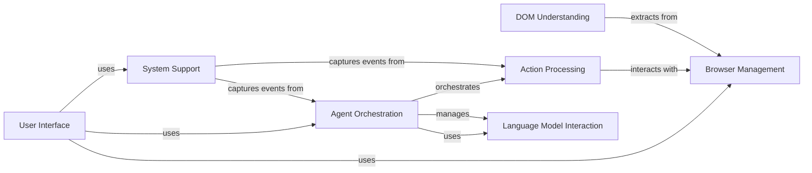

## Component Details

The browser-use project automates web browser interactions using a language model. The core flow involves the user providing a task through the CLI, which is then orchestrated by the Agent. The Agent leverages a language model to plan and execute actions within a browser session. The system extracts information from the DOM, manages messages between the agent and the language model, and provides utilities for configuration, telemetry, and signal handling. The system is designed to be extensible and configurable, allowing users to customize the behavior of the agent and the browser.

### User Interface
The User Interface component provides the entry point for users to interact with the browser automation system. It handles user input, configuration loading, and orchestrates the execution of tasks. It presents the application to the user and translates user commands into actions within the system.
- **Related Classes/Methods**: `browser-use.browser_use.cli`, `browser-use.browser_use.cli.BrowserUseApp`

### Agent Orchestration
The Agent Orchestration component manages the overall browser automation process. It initializes and orchestrates the interaction between the language model, the browser controller, and the message manager. It is responsible for planning, executing, and validating actions, as well as maintaining the agent's history and state.
- **Related Classes/Methods**: `browser_use.agent.service.Agent`, `browser_use.agent.service.Agent:run`, `browser_use.agent.service.Agent:step`, `browser_use.agent.service.Agent:get_next_action`

### Browser Management
The Browser Management component is responsible for managing the browser instance and enabling interactions with web pages. It handles browser startup, shutdown, navigation, and interaction with web pages. It provides methods for getting the current page, executing JavaScript, and extracting page content, abstracting away the complexities of browser automation.
- **Related Classes/Methods**: `browser-use.browser_use.browser.session.BrowserSession`, `browser-use.browser_use.browser.session.BrowserSession:start`, `browser-use.browser_use.browser.session.BrowserSession:navigate_to`, `browser-use.browser_use.browser.session.BrowserSession:get_state_summary`

### Action Processing
The Action Processing component acts as an intermediary between the agent and the browser. It receives actions from the agent and executes them in the browser using the Browser Session. It manages action registries and telemetry, translating high-level actions into specific browser commands and monitoring their execution.
- **Related Classes/Methods**: `browser_use.controller.service.Controller`, `browser_use.controller.service.Controller:act`, `browser_use.controller.registry.service.Registry`, `browser_use.controller.registry.service.Registry:action`, `browser_use.controller.registry.service.Registry:execute_action`

### DOM Understanding
The DOM Understanding component provides utilities for extracting and processing the Document Object Model (DOM) of web pages. It is used to build DOM trees, identify clickable elements, and extract text content, enabling the agent to understand the structure and content of web pages.
- **Related Classes/Methods**: `browser_use.dom.service.DomService`, `browser_use.dom.service.DomService:get_clickable_elements`, `browser_use.dom.service.DomService:_build_dom_tree`, `browser_use.dom.clickable_element_processor.service.ClickableElementProcessor`, `browser_use.dom.clickable_element_processor.service.ClickableElementProcessor:get_clickable_elements_hashes`, `browser_use.dom.clickable_element_processor.service.ClickableElementProcessor:hash_dom_element`

### Language Model Interaction
The Language Model Interaction component encompasses the prompts and message management necessary for effective communication with the language model. It defines and manages the prompts used to communicate with the language model and handles the storage, retrieval, and processing of messages exchanged between the agent and the language model.
- **Related Classes/Methods**: `browser_use.agent.prompts.SystemPrompt`, `browser_use.agent.prompts.PlannerPrompt`, `browser_use.agent.prompts.AgentMessagePrompt`, `browser_use.agent.message_manager.service.MessageManager`, `browser_use.agent.message_manager.service.MessageManager:add_new_task`, `browser_use.agent.message_manager.service.MessageManager:get_messages`

### System Support
The System Support component provides utilities for configuration, telemetry, and signal handling. It captures and reports usage data for the browser automation system and manages signals such as SIGINT and SIGTERM, allowing the system to gracefully handle interruptions and shutdowns.
- **Related Classes/Methods**: `browser_use.telemetry.service.ProductTelemetry`, `browser-use.browser_use.telemetry.service.ProductTelemetry:capture`, `browser_use.utils.SignalHandler`, `browser-use.browser_use.utils.SignalHandler:register`, `browser-use.browser_use.cli:load_user_config`, `browser-use.browser_use.cli:get_default_config`, `browser-use.browser_use.cli:save_user_config`, `browser-use.browser_use.cli:update_config_with_click_args`