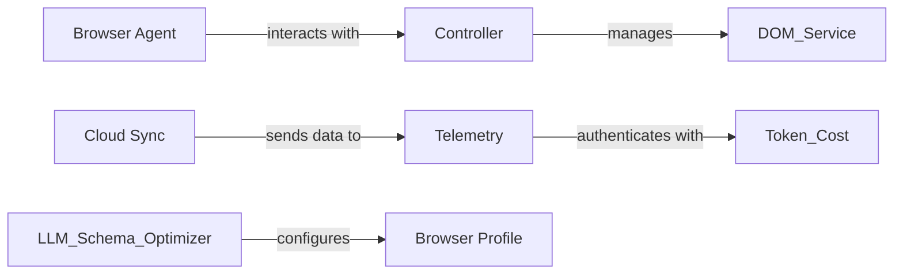

## Details

One paragraph explaining the functionality which is represented by this graph. What the main flow is and what is its purpose.

### Browser Agent [[Expand]](./Browser_Agent.md)
Manages browser automation and testing processes

**Related Classes/Methods**:

- `langchain.tools.tool` (1:100)

### Controller
Manages the DOM Service and coordinates interactions between components

**Related Classes/Methods**:

- `langchain_core.output_parsers.JsonOutputParser` (1:100)

### Cloud Sync [[Expand]](./Cloud_Sync.md)
Synchronizes data with the cloud

**Related Classes/Methods**:

- `langchain.tools.tool` (1:100)

### Telemetry
Analyzes data

**Related Classes/Methods**:

- `langchain_core.output_parsers.JsonOutputParser` (1:100)

### Browser Profile
Manages browser profiles and launch arguments

**Related Classes/Methods**:

- `langchain.tools.tool` (1:100)

### [FAQ](https://github.com/CodeBoarding/GeneratedOnBoardings/tree/main?tab=readme-ov-file#faq)