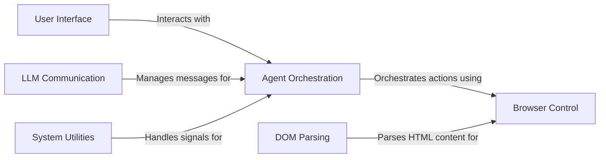

## Component Details

The Browser Use project automates web browser interactions using an AI agent. It provides a user interface (both CLI and TUI) for task initiation and monitoring. The agent orchestrates browser actions based on LLM planning, interacting with the browser through a controller service. The system parses web page content to extract relevant information and manages communication with the LLM. Essential utilities handle signals and ensure graceful operation.

### User Interface
The User Interface component provides multiple ways for users to interact with the Browser Use application. It includes a Command Line Interface (CLI) for configuration and task initiation, and a Textual User Interface (TUI) for visual monitoring and control of the agent's progress. The UI allows users to input tasks, view the agent's actions, and monitor the browser state.
- **Related Classes/Methods**: `browser-use.browser_use.cli`, `browser-use.browser_use.cli.load_user_config`, `browser-use.browser_use.cli.get_default_config`, `browser-use.browser_use.cli.save_user_config`, `browser-use.browser_use.cli.update_config_with_click_args`, `browser-use.browser_use.cli.textual_interface`, `browser-use.browser_use.cli.main`, `browser-use.browser_use.cli.BrowserUseApp`, `browser-use.browser_use.cli.BrowserUseApp.on_mount`, `browser-use.browser_use.cli.BrowserUseApp.on_input_submitted`, `browser-use.browser_use.cli.BrowserUseApp.update_info_panels`, `browser-use.browser_use.cli.BrowserUseApp.run_task`, `browser-use.browser_use.cli.BrowserUseApp.action_quit`

### Agent Orchestration
The Agent Orchestration component is the core of the application, responsible for planning and executing browser interactions. It uses an LLM to determine the next action based on the current browser state and task objectives. It interacts with the Browser Control component to execute those actions and manages the overall task flow.
- **Related Classes/Methods**: `browser_use.agent.service.Agent`, `browser_use.agent.service.Agent.add_new_task`, `browser_use.agent.service.Agent.step`, `browser_use.agent.service.Agent.get_next_action`, `browser_use.agent.service.Agent.run`, `browser_use.agent.service.Agent.multi_act`

### Browser Control
The Browser Control component provides an interface for the Agent to interact with the browser. It receives actions from the Agent, translates them into browser commands, and executes them using the Browser Context. It also manages the browser instance and its contexts, providing a controlled environment for the agent's actions.
- **Related Classes/Methods**: `browser_use.controller.service.Controller`, `browser_use.controller.service.Controller.act`, `browser_use.browser.context.BrowserContext`, `browser_use.browser.context.BrowserContext.navigate_to`, `browser_use.browser.context.BrowserContext.get_state`, `browser_use.browser.context.BrowserContext.execute_javascript`, `browser_use.browser.context.BrowserContext.get_page_html`, `browser_use.browser.browser.Browser`, `browser_use.browser.browser.Browser.new_context`, `browser_use.browser.browser.Browser.close`

### DOM Parsing
The DOM Parsing component is responsible for parsing the HTML content of a web page and extracting relevant information, such as clickable elements and text content. It provides methods for constructing a DOM tree and navigating it to identify elements of interest, enabling the agent to understand and interact with web pages effectively.
- **Related Classes/Methods**: `browser-use.browser_use.dom.service.DomService`, `browser-use.browser_use.dom.service.DomService.get_clickable_elements`, `browser-use.browser_use.dom.service.DomService._build_dom_tree`, `browser-use.browser_use.dom.service.DomService._construct_dom_tree`, `browser-use.browser_use.dom.service.DomService._parse_node`

### LLM Communication
The LLM Communication component manages the messages exchanged between the agent and the LLM. It handles token counting, filtering sensitive data, and formatting messages for the LLM to ensure effective communication and prevent information leakage. This component is crucial for the agent's ability to reason and make decisions based on the LLM's output.
- **Related Classes/Methods**: `browser_use.agent.message_manager.service.MessageManager`, `browser_use.agent.message_manager.service.MessageManager.add_new_task`, `browser_use.agent.message_manager.service.MessageManager.add_state_message`, `browser_use.agent.message_manager.service.MessageManager.add_model_output`, `browser_use.agent.message_manager.service.MessageManager.get_messages`

### System Utilities
The System Utilities component provides essential functionalities such as signal handling, allowing the application to gracefully handle interruptions and exit cleanly. It also includes other utility functions that support the core components, ensuring the stability and reliability of the application.
- **Related Classes/Methods**: `browser-use.browser_use.utils.SignalHandler`, `browser-use.browser_use.utils.SignalHandler.register`, `browser-use.browser_use.utils.SignalHandler.sigint_handler`, `browser-use.browser_use.utils.SignalHandler.wait_for_resume`