```mermaid
graph LR
    User_Interface["User Interface"]
    Agent_Core["Agent Core"]
    Browser_Management["Browser Management"]
    DOM_Processing["DOM Processing"]
    Action_Execution["Action Execution"]
    System_Services["System Services"]
    User_Interface -- "Uses" --> Agent_Core
    User_Interface -- "Uses" --> System_Services
    Agent_Core -- "Manages" --> DOM_Processing
    Agent_Core -- "Interacts with" --> Browser_Management
    Agent_Core -- "Uses" --> Action_Execution
    Browser_Management -- "Configures" --> DOM_Processing
    Action_Execution -- "Executes actions via" --> Browser_Management
    System_Services -- "Captures data from" --> Agent_Core
    System_Services -- "Captures data from" --> User_Interface
    click User_Interface href "https://github.com/CodeBoarding/GeneratedOnBoardings/blob/main/browser-use/User Interface.md" "Details"
    click Agent_Core href "https://github.com/CodeBoarding/GeneratedOnBoardings/blob/main/browser-use/Agent Core.md" "Details"
    click Browser_Management href "https://github.com/CodeBoarding/GeneratedOnBoardings/blob/main/browser-use/Browser Management.md" "Details"
    click DOM_Processing href "https://github.com/CodeBoarding/GeneratedOnBoardings/blob/main/browser-use/DOM Processing.md" "Details"
    click Action_Execution href "https://github.com/CodeBoarding/GeneratedOnBoardings/blob/main/browser-use/Action Execution.md" "Details"
    click System_Services href "https://github.com/CodeBoarding/GeneratedOnBoardings/blob/main/browser-use/System Services.md" "Details"
```

## Component Details

The browser-use project provides an automated browser interaction system driven by an agent. The system allows users to specify tasks, which are then interpreted by the agent to perform actions within a browser. The agent leverages a language model to plan and execute these actions, interacting with web pages through a managed browser session. The system also includes components for managing the DOM, executing actions, and providing a user interface, along with system services for telemetry, logging, and signal handling.

### User Interface
The User Interface component provides the primary means for users to interact with the browser automation system. It handles user input, displays the agent's actions and progress, and allows users to monitor the execution of tasks. It uses a command-line interface built with the textual library.
- **Related Classes/Methods**: `browser_use.browser_use.cli`, `browser_use.browser_use.cli.BrowserUseApp`

### Agent Core
The Agent Core component is the central intelligence of the system. It interprets user tasks, plans actions, and interacts with the browser to achieve the desired outcome. It uses a language model to determine the next action, manages message history, and interacts with the controller to execute actions.
- **Related Classes/Methods**: `browser_use.agent.service.Agent`, `browser_use.agent.gif`, `browser_use.agent.views.AgentHistoryList`, `browser_use.agent.prompts.SystemPrompt`, `browser_use.agent.message_manager.service.MessageManager`, `browser_use.agent.message_manager.views.MessageHistory`, `browser_use.agent.message_manager.utils`

### Browser Management
The Browser Management component is responsible for managing the browser instance and providing methods for interacting with web pages. It handles browser setup, navigation, element interaction, and state retrieval. It uses the Playwright library to control the browser and relies on the DOM processing component for extracting and processing the Document Object Model (DOM) of web pages.
- **Related Classes/Methods**: `browser_use.browser_use.browser.session.BrowserSession`, `browser_use.browser_use.browser.profile.BrowserProfile`

### DOM Processing
The DOM Processing component focuses on extracting, analyzing, and manipulating the Document Object Model (DOM) of web pages. It builds a DOM tree, identifies clickable elements, and extracts text content. It uses the Clickable Element Processor and History Tree Processor for identifying and managing clickable elements.
- **Related Classes/Methods**: `browser_use.browser_use.dom.service.DomService`, `browser_use.browser_use.dom.views.DOMElementNode`, `browser_use.dom.clickable_element_processor.service.ClickableElementProcessor`, `browser_use.dom.history_tree_processor.service.HistoryTreeProcessor`

### Action Execution
The Action Execution component acts as an intermediary between the agent and the available actions. It receives actions from the agent and executes them using the appropriate registered functions. It relies on the Action Registry to manage available actions.
- **Related Classes/Methods**: `browser_use.controller.service.Controller`, `browser_use.controller.registry.service.Registry`, `browser_use.controller.registry.views.ActionRegistry`

### System Services
The System Services component provides essential functionalities such as telemetry, logging, and signal handling. The Telemetry Service captures usage data for analysis. The Logging Configuration sets up the logging system. The Signal Handler manages signals for graceful shutdowns.
- **Related Classes/Methods**: `browser_use.browser_use.telemetry.service.ProductTelemetry`, `browser_use.browser_use.telemetry.views`, `browser_use.browser_use.logging_config`, `browser_use.browser_use.utils.SignalHandler`