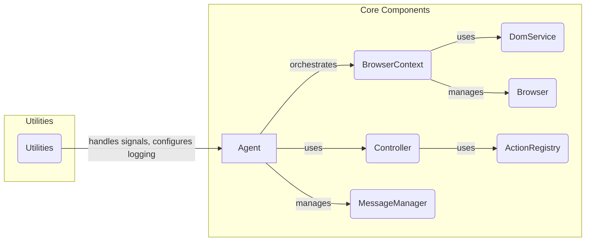

Okay, I will generate an onboarding document for the `browser-use` project based on the provided information.

**1. Project Description**

The `browser-use` project implements an autonomous web browser agent. It allows an agent, driven by a Large Language Model (LLM), to interact with web pages, navigate websites, extract information, and perform actions such as clicking buttons and filling forms. The agent can be used for tasks like web scraping, automated testing, or simulating user behavior.

**2. Flow Diagram (Mermaid)**

**3. Component Descriptions**

*   **Agent:** The Agent is the central orchestrator of the browsing task. It plans the steps needed to achieve a goal, interacts with the LLM to determine the next action, and uses the Controller to execute those actions. It also manages its state and memory using the MessageManager.

*   **BrowserContext:** The BrowserContext manages the browser session. It handles navigation to URLs, provides access to the current state of the DOM, and allows the Agent to interact with web elements on the page. It relies on the Browser component to manage the underlying browser instance.

*   **Controller:** The Controller is responsible for executing actions on the browser, such as clicking elements or inputting text. It receives instructions from the Agent and uses the ActionRegistry to find and execute the appropriate action.

*   **MessageManager:** The MessageManager handles the conversation history between the Agent and the LLM. It stores and retrieves messages, allowing the Agent to maintain context and track its progress.

*   **DomService:** The DomService extracts, processes, and represents the Document Object Model (DOM) of a web page. It builds a tree structure of the DOM, identifies clickable elements, and provides methods for interacting with the DOM.

*   **ActionRegistry:** The ActionRegistry manages the available actions that the Agent can perform. It provides a central location for registering and retrieving actions, allowing the Controller to execute them.

*   **Browser:** The Browser component manages the underlying browser instance (e.g., Playwright). It provides a low-level interface for interacting with the browser, such as navigating to URLs and interacting with web elements.

*   **Utilities:** The Utilities component provides functionalities such as signal handling for graceful pausing or exiting the agent, and logging configuration. It ensures the application behaves correctly in different scenarios and provides useful debugging information.