```mermaid
graph LR
    Agent_Core["Agent Core"]
    LLM_Integration_Layer["LLM Integration Layer"]
    Browser_Automation_Module["Browser Automation Module"]
    Tool_Action_Registry["Tool/Action Registry"]
    CLI_Interface["CLI Interface"]
    MCP_Model_Context_Protocol_Client_Server["MCP (Model Context Protocol) Client/Server"]
    Configuration_Management["Configuration Management"]
    File_System_Manager["File System Manager"]
    Message_History_Manager["Message & History Manager"]
    Token_Cost_Tracking["Token & Cost Tracking"]
    CLI_Interface -- "initiates and controls tasks within" --> Agent_Core
    Agent_Core -- "sends prompts to and receives responses from" --> LLM_Integration_Layer
    Agent_Core -- "requests and executes tools/actions from" --> Tool_Action_Registry
    Agent_Core -- "directs and retrieves state from" --> Browser_Automation_Module
    Agent_Core -- "utilizes for file operations" --> File_System_Manager
    Agent_Core -- "updates and retrieves history from" --> Message_History_Manager
    LLM_Integration_Layer -- "reports token usage and cost data to" --> Token_Cost_Tracking
    Browser_Automation_Module -- "provides primitives to" --> Tool_Action_Registry
    Tool_Action_Registry -- "exposes/invokes tools via" --> MCP_Model_Context_Protocol_Client_Server
    CLI_Interface -- "interacts with to load/save settings" --> Configuration_Management
    Configuration_Management -- "provides settings to" --> Agent_Core
    Configuration_Management -- "provides settings to" --> LLM_Integration_Layer
    Configuration_Management -- "provides settings to" --> Browser_Automation_Module
    click LLM_Integration_Layer href "https://github.com/CodeBoarding/GeneratedOnBoardings/blob/main/browser-use/LLM_Integration_Layer.md" "Details"
    click Browser_Automation_Module href "https://github.com/CodeBoarding/GeneratedOnBoardings/blob/main/browser-use/Browser_Automation_Module.md" "Details"
    click Tool_Action_Registry href "https://github.com/CodeBoarding/GeneratedOnBoardings/blob/main/browser-use/Tool_Action_Registry.md" "Details"
    click CLI_Interface href "https://github.com/CodeBoarding/GeneratedOnBoardings/blob/main/browser-use/CLI_Interface.md" "Details"
    click MCP_Model_Context_Protocol_Client_Server href "https://github.com/CodeBoarding/GeneratedOnBoardings/blob/main/browser-use/MCP_Model_Context_Protocol_Client_Server.md" "Details"
    click Configuration_Management href "https://github.com/CodeBoarding/GeneratedOnBoardings/blob/main/browser-use/Configuration_Management.md" "Details"
    click Token_Cost_Tracking href "https://github.com/CodeBoarding/GeneratedOnBoardings/blob/main/browser-use/Token_Cost_Tracking.md" "Details"
```

## Details

The `browser-use` project implements an AI Agent-driven architecture for browser automation, with the **Agent Core** serving as the central orchestrator. This core component leverages the **LLM Integration Layer** for intelligent decision-making and action generation, which are then executed through the **Tool/Action Registry**. The registry provides access to essential capabilities such as the **Browser Automation Module** for web interactions, the **File System Manager** for local data handling, and the **Message & History Manager** for maintaining conversational context. Users interact with the system via the **CLI Interface**, which relies on **Configuration Management** for system settings. Furthermore, the **MCP Client/Server** extends the agent's capabilities by integrating with external services, while **Token & Cost Tracking** monitors LLM usage. This modular and agent-centric design ensures a clear, efficient, and extensible framework for complex browser automation tasks.

### Agent Core
The central orchestrator and decision-making unit, responsible for managing task execution and coordinating interactions across other components.

**Related Classes/Methods**:

- <a href="https://github.com/browser-use/browser-use/blob/main/browser_use/agent/service.py" target="_blank" rel="noopener noreferrer">`browser_use.agent.service`</a>

### LLM Integration Layer [[Expand]](./LLM_Integration_Layer.md)
Provides a unified, pluggable interface for interacting with various Large Language Models, handling model-specific communication and data formatting.

**Related Classes/Methods**:

- <a href="https://github.com/browser-use/browser-use/blob/main/browser_use/llm/base.py" target="_blank" rel="noopener noreferrer">`browser_use.llm.base`</a>
- <a href="https://github.com/browser-use/browser-use/blob/main/browser_use/llm/openai/chat.py" target="_blank" rel="noopener noreferrer">`browser_use.llm.openai.chat`</a>

### Browser Automation Module [[Expand]](./Browser_Automation_Module.md)
Manages all browser interactions using Playwright, including navigation, DOM manipulation, and event handling.

**Related Classes/Methods**:

- <a href="https://github.com/browser-use/browser-use/blob/main/browser_use/browser/session.py" target="_blank" rel="noopener noreferrer">`browser_use.browser.session`</a>
- <a href="https://github.com/browser-use/browser-use/blob/main/browser_use/dom/service.py" target="_blank" rel="noopener noreferrer">`browser_use.dom.service`</a>

### Tool/Action Registry [[Expand]](./Tool_Action_Registry.md)
A centralized system for registering, discovering, and executing various actions (tools) that the Agent can leverage.

**Related Classes/Methods**:

- <a href="https://github.com/browser-use/browser-use/blob/main/browser_use/controller/registry/service.py" target="_blank" rel="noopener noreferrer">`browser_use.controller.registry.service`</a>

### CLI Interface [[Expand]](./CLI_Interface.md)
Provides the command-line interface for users to interact with the agent, initiate tasks, and manage settings.

**Related Classes/Methods**:

- <a href="https://github.com/browser-use/browser-use/blob/main/browser_use/cli.py" target="_blank" rel="noopener noreferrer">`browser_use.cli`</a>

### MCP (Model Context Protocol) Client/Server [[Expand]](./MCP_Model_Context_Protocol_Client_Server.md)
Facilitates communication with external services compliant with the Model Context Protocol, enabling remote tool invocation and exposure of agent capabilities.

**Related Classes/Methods**:

- <a href="https://github.com/browser-use/browser-use/blob/main/browser_use/mcp/client.py" target="_blank" rel="noopener noreferrer">`browser_use.mcp.client`</a>
- <a href="https://github.com/browser-use/browser-use/blob/main/browser_use/mcp/server.py" target="_blank" rel="noopener noreferrer">`browser_use.mcp.server`</a>

### Configuration Management [[Expand]](./Configuration_Management.md)
Handles the loading, saving, validation, and migration of project configurations, including LLM settings and browser profiles.

**Related Classes/Methods**:

- <a href="https://github.com/browser-use/browser-use/blob/main/browser_use/config.py" target="_blank" rel="noopener noreferrer">`browser_use.config`</a>

### File System Manager
Provides an abstraction layer for secure and controlled file system operations within the agent's operational context.

**Related Classes/Methods**:

- <a href="https://github.com/browser-use/browser-use/blob/main/browser_use/filesystem/file_system.py" target="_blank" rel="noopener noreferrer">`browser_use.filesystem.file_system`</a>

### Message & History Manager
Manages the conversation history and agent messages, including formatting and sensitive data filtering for LLM interactions.

**Related Classes/Methods**:

- <a href="https://github.com/browser-use/browser-use/blob/main/browser_use/agent/message_manager/service.py" target="_blank" rel="noopener noreferrer">`browser_use.agent.message_manager.service`</a>

### Token & Cost Tracking [[Expand]](./Token_Cost_Tracking.md)
Monitors and calculates token usage and associated costs for LLM interactions, providing insights into operational expenses.

**Related Classes/Methods**:

- <a href="https://github.com/browser-use/browser-use/blob/main/browser_use/tokens/service.py" target="_blank" rel="noopener noreferrer">`browser_use.tokens.service`</a>

### [FAQ](https://github.com/CodeBoarding/GeneratedOnBoardings/tree/main?tab=readme-ov-file#faq)