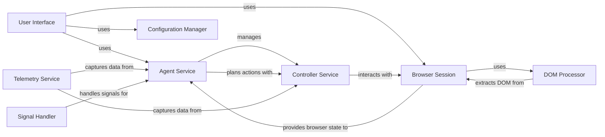

## Component Details

The browser-use project provides an automation framework for web browsers, enabling users to script and execute actions within a browser environment. The core flow involves the Agent Service planning actions based on the current browser state, the Controller Service translating these actions into browser interactions, and the Browser Session managing the browser instance. The DOM Processor extracts and processes the DOM, providing structured information to the Agent. The User Interface allows users to interact with the system, while the Telemetry Service captures usage data. The Configuration Manager handles user settings, and the Signal Handler ensures graceful shutdown.

### User Interface
The User Interface component provides the entry point for users to interact with the browser automation system. It encompasses both the command-line interface (CLI) and any potential graphical user interfaces (GUIs). It handles user input, displays information, and manages the execution of tasks, leveraging libraries like Textual and Click for creating interactive and accessible interfaces.
- **Related Classes/Methods**: `browser-use.browser_use.cli`

### Agent Service
The Agent Service is the central orchestrator of the browser automation system. It manages the agent's state, plans actions based on the current browser state and task objectives, and delegates the execution of those actions to the Controller Service. It incorporates message management, prompt generation, and telemetry logging to ensure efficient and insightful automation.
- **Related Classes/Methods**: `browser_use.agent.service.Agent`, `browser_use.agent.message_manager.service.MessageManager`

### Controller Service
The Controller Service acts as an intermediary, translating high-level actions from the Agent Service into specific browser interactions. It receives action requests, consults its action registry to determine the appropriate execution strategy, and then interacts with the Browser Session to perform the requested action. It also handles sensitive data replacement to protect user privacy.
- **Related Classes/Methods**: `browser_use.controller.service.Controller`, `browser_use.controller.registry.service.Registry`

### Browser Session
The Browser Session component manages the lifecycle of the browser instance and provides a set of methods for interacting with web pages. It handles browser setup, navigation, element selection, and state retrieval, leveraging the Playwright library for robust and reliable browser automation. It serves as the direct interface to the web browser.
- **Related Classes/Methods**: `browser-use.browser_use.browser.session.BrowserSession`

### DOM Processor
The DOM Processor component is responsible for extracting, processing, and analyzing the Document Object Model (DOM) of web pages. It builds a DOM tree, identifies clickable elements, and provides structured information about the page structure to the Agent Service, enabling intelligent decision-making during automation tasks. It encompasses history tracking and clickable element identification.
- **Related Classes/Methods**: `browser_use.dom.service.DomService`, `browser_use.dom.history_tree_processor.service.HistoryTreeProcessor`, `browser_use.dom.clickable_element_processor.service.ClickableElementProcessor`

### Telemetry Service
The Telemetry Service component captures and transmits usage data to track the performance and behavior of the browser automation system. It records events related to agent actions, controller functions, and other system activities, providing valuable insights for system optimization and improvement. It helps in understanding how the system is being used and identifying potential issues.
- **Related Classes/Methods**: `browser-use.browser_use.telemetry.service.ProductTelemetry`

### Configuration Manager
The Configuration Manager component is responsible for loading, saving, and updating user configuration settings. It provides default configurations and allows users to customize the behavior of the browser automation system, ensuring flexibility and adaptability to different user needs and environments. It manages the application's settings.
- **Related Classes/Methods**: `browser-use.browser_use.cli`

### Signal Handler
The Signal Handler component provides a mechanism for handling system signals such as SIGINT and SIGTERM. It allows the system to gracefully shut down or pause execution when these signals are received, preventing data loss and ensuring a clean exit. It ensures the application responds correctly to system events.
- **Related Classes/Methods**: `browser-use.browser_use.utils.SignalHandler`