```mermaid
graph LR
    User_Interface["User Interface"]
    Agent_Orchestration["Agent Orchestration"]
    Context_Management["Context Management"]
    Action_Execution["Action Execution"]
    Browser_Automation["Browser Automation"]
    Web_Content_Processing["Web Content Processing"]
    System_Configuration["System Configuration"]
    User_Interface -- "interacts with" --> Agent_Orchestration
    Agent_Orchestration -- "uses" --> Context_Management
    Agent_Orchestration -- "delegates actions to" --> Action_Execution
    Action_Execution -- "uses" --> Browser_Automation
    Browser_Automation -- "relies on" --> Web_Content_Processing
    User_Interface -- "uses" --> System_Configuration
    click User_Interface href "https://github.com/CodeBoarding/GeneratedOnBoardings/blob/main/browser-use/User Interface.md" "Details"
    click Agent_Orchestration href "https://github.com/CodeBoarding/GeneratedOnBoardings/blob/main/browser-use/Agent Orchestration.md" "Details"
    click Context_Management href "https://github.com/CodeBoarding/GeneratedOnBoardings/blob/main/browser-use/Context Management.md" "Details"
    click Action_Execution href "https://github.com/CodeBoarding/GeneratedOnBoardings/blob/main/browser-use/Action Execution.md" "Details"
    click Browser_Automation href "https://github.com/CodeBoarding/GeneratedOnBoardings/blob/main/browser-use/Browser Automation.md" "Details"
    click Web_Content_Processing href "https://github.com/CodeBoarding/GeneratedOnBoardings/blob/main/browser-use/Web Content Processing.md" "Details"
    click System_Configuration href "https://github.com/CodeBoarding/GeneratedOnBoardings/blob/main/browser-use/System Configuration.md" "Details"
```

## Component Details

The BrowserUse project automates web browser interactions based on user instructions. It leverages a language model to plan actions, a controller to execute those actions, and Playwright for browser automation. The system provides a command-line interface for users to interact with the agent, view the conversation history, and manage tasks. The core flow involves the user providing a task, the agent planning a series of actions, the controller executing those actions in a browser environment, and the results being presented back to the user.

### User Interface
The User Interface component provides a command-line interface for users to interact with the BrowserUse application. It handles user input, displays information panels, and manages the execution of tasks. It uses Textual to create a rich terminal UI, allowing users to monitor and control the automated browsing process.
- **Related Classes/Methods**: `browser_use.cli.BrowserUseApp`, `browser_use.cli:load_user_config`, `browser_use.cli:textual_interface`, `browser_use.cli:main`

### Agent Orchestration
The Agent Orchestration component is responsible for planning and executing tasks. It interacts with a language model (LLM) to determine actions, manages the history of actions, and handles errors. It orchestrates the task execution flow by delegating actions to the Action Execution component and managing the conversation with the user through the Message Management component.
- **Related Classes/Methods**: `browser_use.agent.service.Agent`, `browser_use.agent.service.Agent:add_new_task`, `browser_use.agent.service.Agent:step`, `browser_use.agent.service.Agent:run`, `browser_use.agent.playwright_script_generator.PlaywrightScriptGenerator`

### Context Management
The Context Management component manages the conversation history between the user and the agent, including input messages, model outputs, and tool messages. It also handles token counting and filtering of sensitive data. It provides a view of the message history for the user interface, ensuring a coherent and secure interaction flow.
- **Related Classes/Methods**: `browser_use.agent.message_manager.service.MessageManager`, `browser_use.agent.message_manager.views.MessageHistory`

### Action Execution
The Action Execution component is responsible for executing actions determined by the agent. It interacts with the action registry to find and execute the appropriate action. It serves as the bridge between the agent's planned actions and the actual execution of those actions via the Browser Automation Engine.
- **Related Classes/Methods**: `browser_use.controller.service.Controller`, `browser_use.controller.registry.service.Registry`

### Browser Automation
The Browser Automation component handles the automation of browser interactions using Playwright. It manages browser contexts, tabs, and page state, and provides methods for navigating, executing JavaScript, and extracting DOM information. It is the core component for interacting with web pages programmatically, enabling the execution of actions planned by the agent.
- **Related Classes/Methods**: `browser_use.browser.browser.Browser`, `browser_use.browser.context.BrowserContext`

### Web Content Processing
The Web Content Processing component provides services for extracting and processing the Document Object Model (DOM) of web pages. It builds DOM trees, identifies clickable elements, and handles cross-origin iframes. It enables the system to understand and interact with the structure of web pages, facilitating targeted actions and information extraction.
- **Related Classes/Methods**: `browser_use.dom.service.DomService`, `browser_use.dom.views.DOMElementNode`

### System Configuration
The System Configuration component configures the logging for the application, including setting up rich logging with custom formatters. It also handles signals such as SIGINT (Ctrl+C) to allow for graceful interruption and resumption of tasks, ensuring the application runs smoothly and can be gracefully stopped.
- **Related Classes/Methods**: `browser_use.logging_config:setup_logging`, `browser_use.browser_use.utils.SignalHandler`