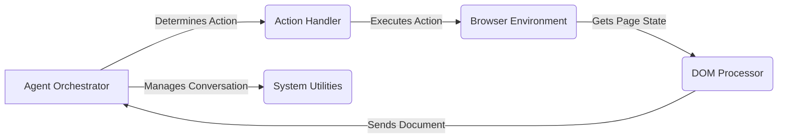

Okay, I will generate an onboarding document for the `browser-use` project based on the provided information.

**1. Project Description**

The `browser-use` project implements an intelligent agent that can interact with web browsers to perform tasks. It combines a language model (LLM) with browser automation to enable autonomous navigation, information retrieval, and task completion on the web. The agent can understand instructions, explore web pages, fill out forms, and extract data, effectively automating various browsing-related activities.

**2. Data Flow Diagram (Mermaid Format)**

**3. Component Descriptions**

*   **Agent Orchestrator:** This component is the brain of the system. It takes instructions, uses an LLM to determine the next action to take, manages the conversation history with the LLM, and orchestrates the interaction with other components to achieve the desired goal.
*   **Action Handler:** This component receives the action determined by the Agent Orchestrator and executes it on the Browser Environment. It acts as an intermediary between the agent's decision-making and the actual browser interaction.
*   **Browser Environment:** This component encapsulates the browser session and provides an interface for interacting with the browser. It handles navigation, element interaction (e.g., clicks, form filling), and retrieval of the current page state.
*   **DOM Processor:** This component is responsible for extracting and processing the Document Object Model (DOM) of a web page. It builds a tree representation of the DOM and identifies clickable elements, providing a structured view of the page content to the Agent Orchestrator.
*   **System Utilities:** This component provides utility functions for handling signals and other system-level tasks.