```mermaid
graph LR
    User_Interface_Configuration["User Interface & Configuration"]
    Browser_Management["Browser Management"]
    DOM_Processing_Abstraction["DOM Processing & Abstraction"]
    Agent_Orchestration_Planning["Agent Orchestration & Planning"]
    Action_Execution_Registry["Action Execution & Registry"]
    LLM_Interaction["LLM Interaction"]
    Telemetry_System_Handling["Telemetry & System Handling"]
    User_Interface_Configuration -- "uses" --> Configuration_Management
    User_Interface_Configuration -- "launches" --> Agent_Orchestration_Planning
    User_Interface_Configuration -- "interacts with" --> Agent_Orchestration_Planning
    Agent_Orchestration_Planning -- "manages" --> LLM_Interaction
    Agent_Orchestration_Planning -- "uses" --> Action_Execution_Registry
    Action_Execution_Registry -- "uses" --> Browser_Management
    Action_Execution_Registry -- "uses" --> DOM_Processing_Abstraction
    DOM_Processing_Abstraction -- "extracts data from" --> Browser_Management
    Agent_Orchestration_Planning -- "uses" --> Telemetry_System_Handling
    LLM_Interaction -- "filters messages with" --> Configuration_Management
    Agent_Orchestration_Planning -- "handles signals with" --> Telemetry_System_Handling
    Agent_Orchestration_Planning -- "plans actions with" --> LLM_Interaction
    click User_Interface_Configuration href "https://github.com/CodeBoarding/GeneratedOnBoardings/blob/main/browser-use/User Interface & Configuration.md" "Details"
    click Browser_Management href "https://github.com/CodeBoarding/GeneratedOnBoardings/blob/main/browser-use/Browser Management.md" "Details"
    click DOM_Processing_Abstraction href "https://github.com/CodeBoarding/GeneratedOnBoardings/blob/main/browser-use/DOM Processing & Abstraction.md" "Details"
    click Agent_Orchestration_Planning href "https://github.com/CodeBoarding/GeneratedOnBoardings/blob/main/browser-use/Agent Orchestration & Planning.md" "Details"
    click Action_Execution_Registry href "https://github.com/CodeBoarding/GeneratedOnBoardings/blob/main/browser-use/Action Execution & Registry.md" "Details"
    click LLM_Interaction href "https://github.com/CodeBoarding/GeneratedOnBoardings/blob/main/browser-use/LLM Interaction.md" "Details"
    click Telemetry_System_Handling href "https://github.com/CodeBoarding/GeneratedOnBoardings/blob/main/browser-use/Telemetry & System Handling.md" "Details"
```

## Component Details

The browser-use project automates web browser interactions, enabling users to perform tasks such as data extraction, form filling, and web application testing. It leverages a large language model (LLM) to plan and execute actions within a browser environment, providing a flexible and intelligent automation solution. The system integrates a user interface, browser management, DOM processing, and an agent orchestration service to achieve its goals.

### User Interface & Configuration
This component encompasses the user interface (CLI and Textual UI) and the configuration management aspects of the system. It handles user input, displays information, loads and saves configuration settings, and allows users to customize the behavior of the browser automation system. It serves as the entry point for user interaction and manages the application's configuration.
- **Related Classes/Methods**: `browser-use.browser_use.cli`, `browser-use.browser_use.cli.BrowserUseApp`, `browser-use.browser_use.cli.load_user_config`, `browser-use.browser_use.cli.save_user_config`, `browser-use.browser_use.cli.get_default_config`, `browser-use.browser_use.cli.update_config_with_click_args`

### Browser Management
This component manages the lifecycle of browser instances using Playwright. It provides methods for starting, stopping, and interacting with the browser, including tab management, navigation, and element interaction. It provides the foundation for executing actions in the browser.
- **Related Classes/Methods**: `browser-use.browser_use.browser.session.BrowserSession`

### DOM Processing & Abstraction
This component extracts and processes the DOM of web pages, building a DOM tree, identifying clickable elements, and extracting relevant information from the page structure. It provides the agent with a structured representation of the web page, enabling it to understand the page's content and identify potential actions.
- **Related Classes/Methods**: `browser-use.browser_use.dom.service.DomService`, `browser-use.browser_use.dom.clickable_element_processor.service.ClickableElementProcessor`, `browser_use.dom.history_tree_processor.service.HistoryTreeProcessor`

### Agent Orchestration & Planning
This component orchestrates the browser automation process, managing the agent's state, interacting with the LLM for planning, executing actions in the browser, and maintaining a history of interactions. It is the central control point for the automation process, coordinating the activities of other components to achieve the user's goals.
- **Related Classes/Methods**: `browser_use.agent.service.Agent`

### Action Execution & Registry
This component provides an interface for executing actions in the browser, interacting with the Browser Management and DOM Processing components to perform tasks such as clicking elements, inputting text, and navigating pages. It also manages the available actions that the agent can perform, providing methods for registering actions, retrieving action descriptions, and executing actions.
- **Related Classes/Methods**: `browser_use.controller.service.Controller`, `browser_use.controller.registry.service.Registry`, `browser_use.controller.registry.views.ActionRegistry`

### LLM Interaction
This component manages the prompts used to interact with the LLM and the messages exchanged between the agent and the LLM. It provides templates for the prompts, methods for customizing them, and methods for adding messages, filtering sensitive data, and counting tokens. It ensures that the communication between the agent and the LLM is clear, concise, and secure.
- **Related Classes/Methods**: `browser_use.agent.prompts.SystemPrompt`, `browser_use.agent.prompts.PlannerPrompt`, `browser_use.agent.prompts.AgentMessagePrompt`, `browser_use.agent.message_manager.service.MessageManager`, `browser_use.agent.message_manager.views.MessageHistory`

### Telemetry & System Handling
This component captures and reports telemetry data, providing insights into the system's performance and usage. It also handles signals such as SIGINT and SIGTERM, allowing the program to gracefully shut down or restart. It ensures the stability and monitoring of the system.
- **Related Classes/Methods**: `browser-use.browser_use.telemetry.service.ProductTelemetry`, `browser-use.browser_use.utils.SignalHandler`