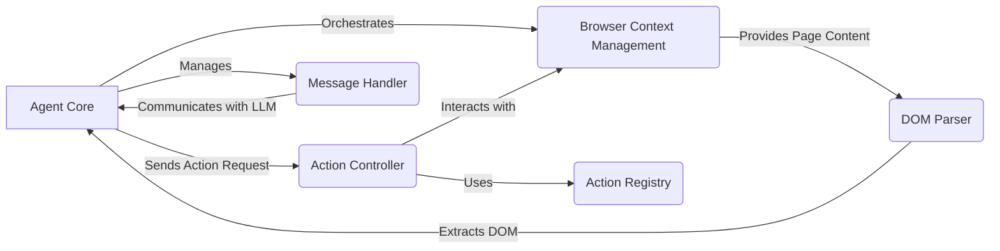

Okay, I'm ready to generate the high-level data flow diagram for the `browser-use` project.

**1. Project Description:**

The `browser-use` project enables AI agents to interact with web browsers programmatically. It provides tools and services for agents to navigate web pages, extract information, and perform actions, allowing them to automate tasks and interact with web-based applications.

**2. Data Flow Diagram (Mermaid Format):**

**3. Component Descriptions:**

*   **Agent Core:** This component manages the agent's lifecycle, planning, and execution. It orchestrates the interaction between the Browser Context Management, Action Controller, DOM Parser, and Message Handler. It receives parsed DOM from the DOM Parser and sends action requests to the Action Controller. It also manages communication with the LLM through the Message Handler.

*   **Browser Context Management:** This component provides an interface for interacting with the browser, including navigation, content retrieval, and state management. It receives navigation requests from the Agent Core and provides page content to the DOM Parser. It also interacts with the Action Controller to execute actions in the browser.

*   **Action Controller:** This component executes actions in the browser based on instructions from the Agent Core. It uses the Action Registry to determine the available actions and interacts with the Browser Context Management to perform the actions.

*   **DOM Parser:** This component parses the DOM structure of a web page and extracts relevant information. It receives page content from the Browser Context Management and provides a structured representation of the DOM to the Agent Core.

*   **Action Registry:** This component maintains a registry of available actions that the agent can perform. It is used by the Action Controller to determine the available actions and execute them.

*   **Message Handler:** This component manages the messages exchanged between the agent and the LLM. It is used by the Agent Core to construct prompts, manage conversation history, and communicate with the LLM.