```mermaid
graph LR
    Agent_Execution_Engine["Agent Execution Engine"]
    LLM_Integration_Layer["LLM Integration Layer"]
    MCP_Protocol_Adapter["MCP Protocol Adapter"]
    Browser_Automation_Core["Browser Automation Core"]
    Infrastructure_Services_Suite["Infrastructure Services Suite"]
    Agent_Execution_Engine -- "uses" --> LLM_Integration_Layer
    Agent_Execution_Engine -- "authenticates through" --> Infrastructure_Services_Suite
    Agent_Execution_Engine -- "communicates via" --> MCP_Protocol_Adapter
    MCP_Protocol_Adapter -- "controls" --> Browser_Automation_Core
    Browser_Automation_Core -- "processes documents via" --> Infrastructure_Services_Suite
    LLM_Integration_Layer -- "monitors costs through" --> Infrastructure_Services_Suite
    click Agent_Execution_Engine href "https://github.com/CodeBoarding/GeneratedOnBoardings/blob/main/browser-use/Agent_Execution_Engine.md" "Details"
    click LLM_Integration_Layer href "https://github.com/CodeBoarding/GeneratedOnBoardings/blob/main/browser-use/LLM_Integration_Layer.md" "Details"
    click MCP_Protocol_Adapter href "https://github.com/CodeBoarding/GeneratedOnBoardings/blob/main/browser-use/MCP_Protocol_Adapter.md" "Details"
    click Browser_Automation_Core href "https://github.com/CodeBoarding/GeneratedOnBoardings/blob/main/browser-use/Browser_Automation_Core.md" "Details"
    click Infrastructure_Services_Suite href "https://github.com/CodeBoarding/GeneratedOnBoardings/blob/main/browser-use/Infrastructure_Services_Suite.md" "Details"
```

## Details

One paragraph explaining the functionality which is represented by this graph. What the main flow is and what is its purpose.

### Agent Execution Engine [[Expand]](./Agent_Execution_Engine.md)
Central AI logic and decision-making core. Manages conversation flow, task planning, and cross-component coordination.

**Related Classes/Methods**:

- `browser_use.agent.Agent` (23:145)

### LLM Integration Layer [[Expand]](./LLM_Integration_Layer.md)
Abstracts multiple LLM providers (OpenAI, Anthropic, Google) with unified interface. Handles token cost tracking and response serialization.

**Related Classes/Methods**:

- `browser_use.llm.LLMIntegration` (12:88)

### MCP Protocol Adapter [[Expand]](./MCP_Protocol_Adapter.md)
Implements Model Control Protocol for browser interaction. Acts as bidirectional translator between agent commands and browser automation actions.

**Related Classes/Methods**:

- `browser_use.mcp.MCPAdapter` (45:201)

### Browser Automation Core [[Expand]](./Browser_Automation_Core.md)
Manages Playwright browser instances, DOM manipulation, and element interaction. Executes low-level automation commands with precision.

**Related Classes/Methods**:

- `browser_use.browser.BrowserCore` (78:312)

### Infrastructure Services Suite [[Expand]](./Infrastructure_Services_Suite.md)
Composite layer handling: Cloud Authentication (device auth and cross-device sync), Document Processing (PDF handling and file operations), and Observability (usage telemetry and token cost aggregation)

**Related Classes/Methods**:

- `browser_use.auth.CloudAuth` (34:112)
- `browser_use.document.DocumentProcessor` (15:67)
- `browser_use.telemetry.ObservabilitySystem` (28:93)

### [FAQ](https://github.com/CodeBoarding/GeneratedOnBoardings/tree/main?tab=readme-ov-file#faq)