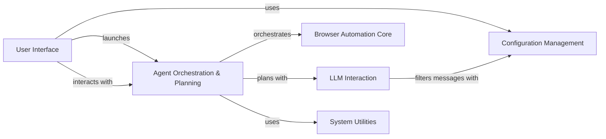

## Component Details

The browser-use project automates web browser interactions, enabling users to perform tasks such as data extraction, form filling, and website navigation through a combination of a command-line interface, a Textual UI, and an agent that leverages a Large Language Model (LLM). The system manages browser sessions, processes the Document Object Model (DOM) to understand web page structure, and orchestrates actions based on LLM-generated plans. Configuration management allows users to customize the system's behavior, while message handling ensures clear communication between the agent and the LLM. Telemetry and signal handling provide insights into system performance and ensure graceful shutdown.

### User Interface
The User Interface component provides the primary means for users to interact with the browser automation system. It encompasses both the command-line interface (CLI) and the Textual UI, allowing users to submit tasks, view the browser state, and control the agent's behavior. It handles argument parsing, configuration loading, and presents information to the user in a clear and accessible manner.
- **Related Classes/Methods**: `browser-use.browser_use.cli`, `browser-use.browser_use.cli.BrowserUseApp`

### Configuration Management
The Configuration Management component is responsible for loading, saving, and managing user configuration settings. It allows users to customize the behavior of the browser automation system, such as setting API keys, specifying browser preferences, and configuring the LLM. This component ensures that the system can be tailored to individual user needs and preferences.
- **Related Classes/Methods**: `browser-use.browser_use.cli.load_user_config`, `browser-use.browser_use.cli.save_user_config`, `browser-use.browser_use.cli.get_default_config`, `browser-use.browser_use.cli.update_config_with_click_args`

### Browser Automation Core
The Browser Automation Core component encapsulates the functionality for interacting with web browsers. It includes managing browser sessions using Playwright, processing the Document Object Model (DOM) to understand web page structure, and executing actions in the browser. This component provides the foundation for the agent to interact with and manipulate web pages.
- **Related Classes/Methods**: `browser-use.browser_use.browser.session.BrowserSession`, `browser-use.browser_use.dom.service.DomService`, `browser-use.browser_use.dom.clickable_element_processor.service.ClickableElementProcessor`, `browser_use.dom.history_tree_processor.service.HistoryTreeProcessor`, `browser_use.controller.service.Controller`, `browser_use.controller.registry.service.Registry`, `browser_use.controller.registry.views.ActionRegistry`

### Agent Orchestration & Planning
The Agent Orchestration & Planning component is the central control point for the browser automation process. It manages the agent's state, interacts with the LLM for planning, executes actions in the browser, and maintains a history of interactions. This component coordinates the activities of other components to achieve the user's goals, making decisions about which actions to take and when.
- **Related Classes/Methods**: `browser_use.agent.service.Agent`

### LLM Interaction
The LLM Interaction component manages the communication between the agent and the LLM. It includes managing the prompts used to interact with the LLM, handling the messages exchanged between the agent and the LLM, and filtering sensitive data. This component ensures that the communication between the agent and the LLM is clear, concise, secure, and effective.
- **Related Classes/Methods**: `browser_use.agent.prompts.SystemPrompt`, `browser_use.agent.prompts.PlannerPrompt`, `browser_use.agent.prompts.AgentMessagePrompt`, `browser_use.agent.message_manager.service.MessageManager`, `browser_use.agent.message_manager.views.MessageHistory`

### System Utilities
The System Utilities component provides supporting functionalities such as capturing and reporting telemetry data, and handling signals such as SIGINT and SIGTERM. It provides insights into the system's performance and usage, and ensures that the program can gracefully shut down or restart.
- **Related Classes/Methods**: `browser-use.browser_use.telemetry.service.ProductTelemetry`, `browser-use.browser_use.utils.SignalHandler`