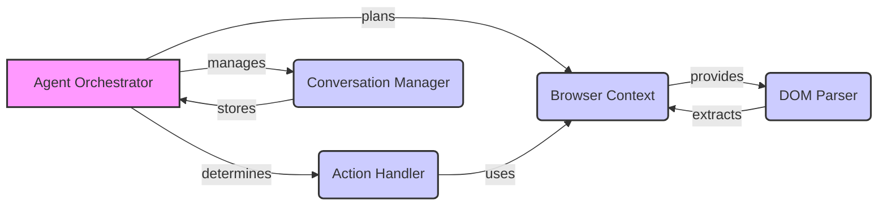

Okay, I will generate an onboarding document for the `browser-use` project based on the provided information.

**1. Project Description**

The `browser-use` project automates web browsing tasks. It allows an agent to interact with web pages, execute actions, and achieve specific goals. The system uses a combination of components to manage browser sessions, parse web page content, determine appropriate actions, and maintain a conversation history.

**2. Data Flow Diagram**

**3. Component Descriptions**

*   **Agent Orchestrator:** This is the central control unit. It plans and executes browsing tasks by deciding which actions to take based on the current state of the browser and the conversation history. It leverages the Browser Context to interact with web pages, the Action Handler to execute actions, and the Conversation Manager to maintain context.

*   **Browser Context:** This component manages the browser session. It provides an interface for navigating to URLs, executing JavaScript, retrieving page state, and taking screenshots. It acts as the bridge between the agent and the actual browser.

*   **Action Handler:** This component executes specific actions on the browser, such as clicking elements or inputting text. It uses the Browser Context to interact with the web page and the Action Registry to determine the appropriate action to perform based on the agent's instructions.

*   **Conversation Manager:** This component maintains the history of interactions between the agent and the user. It stores messages, filters sensitive data, and manages token counts. It provides context to the Agent Orchestrator for decision-making.

*   **DOM Parser:** This component extracts and processes the Document Object Model (DOM) of a web page. It builds the DOM tree, parses nodes, and identifies clickable elements. It provides structured information about the web page to other components, such as the Agent Orchestrator and Action Handler, enabling them to understand the page structure and identify potential actions.