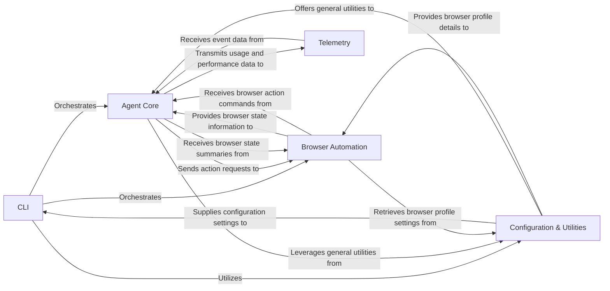

## Component Details

Final Architecture Analysis for `browser-use` - Central Modules and Data Flow Overview

### CLI
The primary entry point for the application. It handles user input, manages the application's lifecycle (startup and shutdown), loads and saves user configurations, and orchestrates the overall execution flow, whether in prompt mode or a textual interface.

**Related Classes/Methods**:

- <a href="https://github.com/browser-use/browser-use/blob/master/browser_use/cli.py#L1-L1" target="_blank" rel="noopener noreferrer">`browser_use/cli.py` (1:1)</a>

### Agent Core
This is the intelligent heart of the application. It's responsible for planning, executing, and managing tasks within the web browser. It interacts with the underlying Large Language Model (LLM), maintains the conversation history, and determines the necessary browser actions based on its reasoning.

**Related Classes/Methods**:

- <a href="https://github.com/browser-use/browser-use/blob/master/browser_use/agent/service.py#L1-L1" target="_blank" rel="noopener noreferrer">`browser_use/agent/service.py` (1:1)</a>
- <a href="https://github.com/browser-use/browser-use/blob/master/browser_use/agent/message_manager/service.py#L1-L1" target="_blank" rel="noopener noreferrer">`browser_use/agent/message_manager/service.py` (1:1)</a>

### Browser Automation
This component manages all direct interactions with the web browser (powered by Playwright). Its responsibilities include browser startup and shutdown, navigation, direct DOM manipulation (e.g., clicking elements, inputting text), capturing screenshots, and processing the DOM to identify interactive elements. It serves as the execution layer for all browser-related actions requested by the `Agent Core`.

**Related Classes/Methods**:

- <a href="https://github.com/browser-use/browser-use/blob/master/browser_use/browser/session.py#L1-L1" target="_blank" rel="noopener noreferrer">`browser_use/browser/session.py` (1:1)</a>
- <a href="https://github.com/browser-use/browser-use/blob/master/browser_use/controller/service.py#L1-L1" target="_blank" rel="noopener noreferrer">`browser_use/controller/service.py` (1:1)</a>
- <a href="https://github.com/browser-use/browser-use/blob/master/browser_use/controller/registry/service.py#L1-L1" target="_blank" rel="noopener noreferrer">`browser_use/controller/registry/service.py` (1:1)</a>
- <a href="https://github.com/browser-use/browser-use/blob/master/browser_use/dom/service.py#L1-L1" target="_blank" rel="noopener noreferrer">`browser_use/dom/service.py` (1:1)</a>
- <a href="https://github.com/browser-use/browser-use/blob/master/browser_use/dom/clickable_element_processor/service.py#L1-L1" target="_blank" rel="noopener noreferrer">`browser_use/dom/clickable_element_processor/service.py` (1:1)</a>
- <a href="https://github.com/browser-use/browser-use/blob/master/browser_use/dom/history_tree_processor/service.py#L1-L1" target="_blank" rel="noopener noreferrer">`browser_use/dom/history_tree_processor/service.py` (1:1)</a>
- <a href="https://github.com/browser-use/browser-use/blob/master/browser_use/browser/views.py#L1-L1" target="_blank" rel="noopener noreferrer">`browser_use/browser/views.py` (1:1)</a>
- <a href="https://github.com/browser-use/browser-use/blob/master/browser_use/dom/views.py#L1-L1" target="_blank" rel="noopener noreferrer">`browser_use/dom/views.py` (1:1)</a>

### Telemetry
Dedicated to collecting and transmitting anonymous usage data and performance metrics. Its primary focus is on capturing insights into agent activities and overall system health, aiding in application improvement and monitoring.

**Related Classes/Methods**:

- <a href="https://github.com/browser-use/browser-use/blob/master/browser_use/telemetry/service.py#L1-L1" target="_blank" rel="noopener noreferrer">`browser_use/telemetry/service.py` (1:1)</a>
- <a href="https://github.com/browser-use/browser-use/blob/master/browser_use/telemetry/views.py#L1-L1" target="_blank" rel="noopener noreferrer">`browser_use/telemetry/views.py` (1:1)</a>

### Configuration & Utilities
This foundational component provides a collection of common utility functions, including logging setup, signal handling, and time execution tracking. Crucially, it also defines and manages the data structures and logic for application-wide configuration, particularly browser profiles and launch arguments, ensuring consistent behavior across the application.

**Related Classes/Methods**:

- <a href="https://github.com/browser-use/browser-use/blob/master/browser_use/utils.py#L1-L1" target="_blank" rel="noopener noreferrer">`browser_use/utils.py` (1:1)</a>
- <a href="https://github.com/browser-use/browser-use/blob/master/browser_use/logging_config.py#L1-L1" target="_blank" rel="noopener noreferrer">`browser_use/logging_config.py` (1:1)</a>
- <a href="https://github.com/browser-use/browser-use/blob/master/browser_use/browser/profile.py#L1-L1" target="_blank" rel="noopener noreferrer">`browser_use/browser/profile.py` (1:1)</a>

### [FAQ](https://github.com/CodeBoarding/GeneratedOnBoardings/tree/main?tab=readme-ov-file#faq)