```mermaid
graph LR
    CLI_Manager["CLI Manager"]
    Agent_Service["Agent Service"]
    Controller_Service["Controller Service"]
    Browser_Session["Browser Session"]
    DOM_Processor["DOM Processor"]
    Message_Manager["Message Manager"]
    Telemetry_Service["Telemetry Service"]
    CLI_Manager -- "initializes and runs" --> Agent_Service
    Agent_Service -- "manages tasks" --> Controller_Service
    Controller_Service -- "executes actions in" --> Browser_Session
    Browser_Session -- "extracts DOM" --> DOM_Processor
    Agent_Service -- "manages messages" --> Message_Manager
    Agent_Service -- "collects data" --> Telemetry_Service
    Controller_Service -- "collects data" --> Telemetry_Service
    Agent_Service -- "uses for managing messages" --> Message_Manager
    click CLI_Manager href "https://github.com/CodeBoarding/GeneratedOnBoardings/blob/main/browser-use/CLI Manager.md" "Details"
    click Agent_Service href "https://github.com/CodeBoarding/GeneratedOnBoardings/blob/main/browser-use/Agent Service.md" "Details"
    click Controller_Service href "https://github.com/CodeBoarding/GeneratedOnBoardings/blob/main/browser-use/Controller Service.md" "Details"
    click Browser_Session href "https://github.com/CodeBoarding/GeneratedOnBoardings/blob/main/browser-use/Browser Session.md" "Details"
    click DOM_Processor href "https://github.com/CodeBoarding/GeneratedOnBoardings/blob/main/browser-use/DOM Processor.md" "Details"
    click Message_Manager href "https://github.com/CodeBoarding/GeneratedOnBoardings/blob/main/browser-use/Message Manager.md" "Details"
    click Telemetry_Service href "https://github.com/CodeBoarding/GeneratedOnBoardings/blob/main/browser-use/Telemetry Service.md" "Details"
```

## Component Details

The browser-use project automates web browser interactions using a language model. The CLI Manager handles user input and configurations, initializing the Agent Service. The Agent Service orchestrates tasks by planning and executing actions, communicating with the language model through the Message Manager, and controlling the browser via the Controller Service. The Controller Service translates agent actions into browser commands using the Browser Session, which interacts with web pages and extracts DOM information through the DOM Processor. The Telemetry Service collects usage data to improve the system.

### CLI Manager
The CLI Manager handles command-line arguments, configuration loading/saving, and initialization of the Agent Service. It acts as the entry point for the application, managing the user interface and configuration settings.
- **Related Classes/Methods**: `browser-use.browser_use.cli`

### Agent Service
The Agent Service is the core orchestration component. It plans and executes tasks by interacting with the language model, managing messages, and controlling the browser through the Controller Service. It's responsible for the overall automation process.
- **Related Classes/Methods**: `browser_use.agent.service.Agent`, `browser_use.agent.prompts.SystemPrompt`, `browser_use.agent.prompts.PlannerPrompt`, `browser_use.agent.prompts.AgentMessagePrompt`

### Controller Service
The Controller Service acts as an intermediary between the Agent Service and the Browser Session. It receives actions from the agent, executes them in the browser, and retrieves DOM information. It manages the interaction with the browser.
- **Related Classes/Methods**: `browser_use.controller.service.Controller`, `browser_use.controller.registry.service.Registry`, `browser_use.controller.registry.views.ActionRegistry`

### Browser Session
The Browser Session manages the browser instance using Playwright. It handles browser setup, navigation, and interaction with web pages. It provides methods for getting page content, executing JavaScript, and taking screenshots.
- **Related Classes/Methods**: `browser-use.browser_use.browser.session.BrowserSession`, `browser-use.browser_use.browser.profile.BrowserProfile`

### DOM Processor
The DOM Processor extracts and processes the Document Object Model (DOM) of web pages. It builds a DOM tree, identifies clickable elements, and provides methods for querying the DOM. It also manages the history of DOM states.
- **Related Classes/Methods**: `browser-use.browser_use.dom.service.DomService`, `browser_use.dom.history_tree_processor.service.HistoryTreeProcessor`, `browser_use.dom.clickable_element_processor.service.ClickableElementProcessor`

### Message Manager
The Message Manager component is responsible for managing the messages exchanged between the agent and the language model. It handles token counting, filtering sensitive data, and formatting messages for the LLM.
- **Related Classes/Methods**: `browser_use.agent.message_manager.service.MessageManager`, `browser_use.agent.message_manager.views.MessageHistory`, `browser_use.agent.message_manager.views.MessageMetadata`

### Telemetry Service
The Telemetry Service component collects and reports usage data and errors. It captures events related to agent activity, controller actions, and registered functions.
- **Related Classes/Methods**: `browser-use.browser_use.telemetry.service.ProductTelemetry`, `browser_use.telemetry.views`