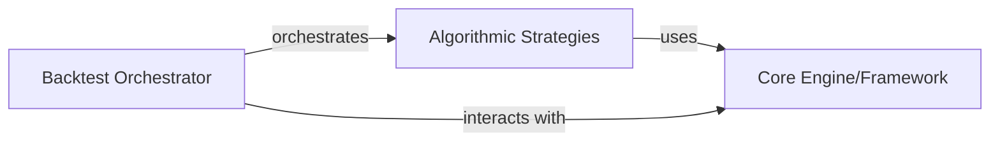

## Details

This architecture for the Quantitative Finance Backtesting framework is designed with modularity, extensibility, and a clear separation of concerns, aligning with the project's domain-specific framework nature. The identified components are fundamental to simulating investment strategies and analyzing their performance.

### Core Engine/Framework
This component forms the foundational layer of the backtesting environment. It provides the essential definitions, data access mechanisms, period management, and state update functionalities that are leveraged by all other components. It defines the "rules of the game" for the backtest.

**Related Classes/Methods**:

- <a href="https://github.com/pmorissette/bt/blob/master/bt/core.py#L1-L1" target="_blank" rel="noopener noreferrer">`bt.core` (1:1)</a>
- <a href="https://github.com/pmorissette/bt/blob/master/bt/backtest.py#L1-L1" target="_blank" rel="noopener noreferrer">`bt.backtest` (1:1)</a>

### Algorithmic Strategies [[Expand]](./Algorithmic_Strategies.md)
This component encapsulates the concrete, executable algorithms that define the specific actions and logic of an investment strategy. These algorithms interact directly with the Core Engine/Framework's definitions to perform operations such as managing investment periods, updating risk profiles, rebalancing portfolios, or hedging positions. This is where the "intelligence" of the investment strategy resides.

**Related Classes/Methods**:

- <a href="https://github.com/pmorissette/bt/blob/master/bt/algos.py#L1-L1" target="_blank" rel="noopener noreferrer">`bt.algos` (1:1)</a>
- <a href="https://github.com/pmorissette/bt/blob/master/bt/algos.py#L1-L1" target="_blank" rel="noopener noreferrer">`bt.algos.RunPeriod` (1:1)</a>
- <a href="https://github.com/pmorissette/bt/blob/master/bt/algos.py#L1-L1" target="_blank" rel="noopener noreferrer">`bt.algos.UpdateRisk` (1:1)</a>
- <a href="https://github.com/pmorissette/bt/blob/master/bt/algos.py#L1-L1" target="_blank" rel="noopener noreferrer">`bt.algos.HedgeRisks` (1:1)</a>

### Backtest Orchestrator
This component acts as the central orchestrator for a backtest run. It is responsible for invoking, managing, and coordinating the execution of the defined Algorithmic Strategies within the context provided by the Core Engine/Framework. It drives the simulation forward, ensuring strategies are applied correctly over time.

**Related Classes/Methods**:

- <a href="https://github.com/pmorissette/bt/blob/master/bt/backtest.py#L1-L1" target="_blank" rel="noopener noreferrer">`bt.backtest.Backtest` (1:1)</a>

### [FAQ](https://github.com/CodeBoarding/GeneratedOnBoardings/tree/main?tab=readme-ov-file#faq)