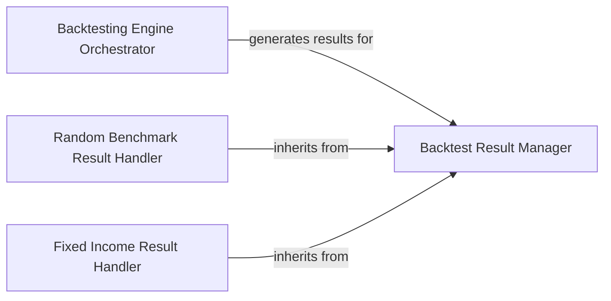

## Details

The `Backtesting Engine` subsystem is central to the `bt` project, orchestrating the simulation of trading strategies against historical data. Its boundaries are primarily defined by the `bt.backtest` module. The components are chosen based on their fundamental architectural importance within a Domain-Specific Framework/Library for Quantitative Finance Backtesting.

### Backtesting Engine Orchestrator
The core component responsible for initiating, managing, and executing the entire backtesting simulation. It takes defined strategies, historical data, and configuration, then simulates their performance over time. It controls the execution flow and maintains the state of the backtest.

**Related Classes/Methods**:

- <a href="https://github.com/pmorissette/bt/blob/master/bt/backtest.py" target="_blank" rel="noopener noreferrer">`bt.backtest.Backtest`</a>

### Backtest Result Manager
Encapsulates, processes, and provides comprehensive access to the outcomes of a backtest. It offers methods for retrieving performance metrics, visualizing results, and managing the overall output data.

**Related Classes/Methods**:

- <a href="https://github.com/pmorissette/bt/blob/master/bt/backtest.py" target="_blank" rel="noopener noreferrer">`bt.backtest.Result`</a>

### Random Benchmark Result Handler
A specialized component extending the `Backtest Result Manager` to provide specific result handling and presentation tailored for backtests involving random benchmark scenarios. It ensures that benchmark-specific metrics and visualizations are correctly processed and displayed.

**Related Classes/Methods**:

- <a href="https://github.com/pmorissette/bt/blob/master/bt/backtest.py" target="_blank" rel="noopener noreferrer">`bt.backtest.RandomBenchmarkResult`</a>

### Fixed Income Result Handler
A specialized component extending the `Backtest Result Manager` to provide specific result handling and presentation for backtests focused on renormalized fixed income scenarios. It manages the unique data structures and calculations required for fixed income performance analysis.

**Related Classes/Methods**:

- <a href="https://github.com/pmorissette/bt/blob/master/bt/backtest.py" target="_blank" rel="noopener noreferrer">`bt.backtest.RenormalizedFixedIncomeResult`</a>

### [FAQ](https://github.com/CodeBoarding/GeneratedOnBoardings/tree/main?tab=readme-ov-file#faq)