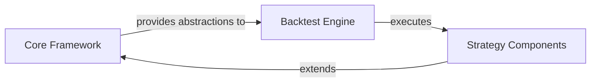

## Details

Abstract Components Overview

### Core Framework [[Expand]](./Core_Framework.md)
The `Core Framework` serves as the foundational layer of the backtesting system. It establishes the essential abstract definitions and building blocks for defining trading strategies, financial instruments (securities), and the execution flow of algorithms. This component provides the fundamental base classes and interfaces that are extended and utilized by other parts of the framework, ensuring a consistent, extensible, and robust structure for all backtesting elements. It embodies the Strategy Pattern and defines the core data structures for financial assets within the system.

**Related Classes/Methods**: _None_

### Backtest Engine
The `Backtest Engine` is responsible for orchestrating and executing the backtesting simulations. It consumes the abstract definitions and building blocks provided by the `Core Framework` to run trading strategies against historical market data. Its primary responsibilities include managing the simulation timeline, processing market events, executing trades based on strategy signals, and collecting performance metrics. It acts as the runtime environment for the strategies defined within the system.

**Related Classes/Methods**: _None_

### Strategy Components
`Strategy Components` represent the concrete implementations of trading strategies within the backtesting system. These components extend or implement the abstract strategy definitions provided by the `Core Framework` (e.g., `bt.core.StrategyBase`, `bt.core.Strategy`). Each strategy component encapsulates the specific trading logic, entry/exit rules, and risk management parameters for a particular trading approach. They interact with the `Backtest Engine` to receive market data and execute orders.

**Related Classes/Methods**: _None_

### [FAQ](https://github.com/CodeBoarding/GeneratedOnBoardings/tree/main?tab=readme-ov-file#faq)