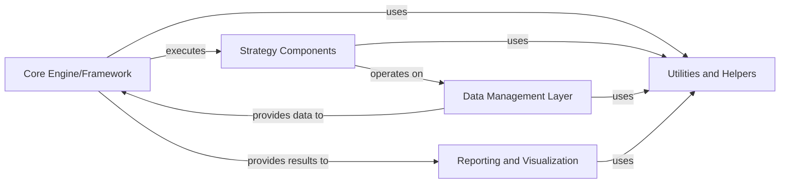

## Details

The `bt` project, a Domain-Specific Framework/Library for Quantitative Finance Backtesting, is structured around a modular and data-driven architecture.

### Core Engine/Framework
The central orchestrator of the backtesting process. It manages the overall execution flow, defines the core logic for running simulations, and coordinates interactions between strategy components and data.

**Related Classes/Methods**:

- <a href="https://github.com/pmorissette/bt/blob/master/bt/core.py#L1-L1" target="_blank" rel="noopener noreferrer">`bt/core.py` (1:1)</a>
- <a href="https://github.com/pmorissette/bt/blob/master/bt/backtest.py#L1-L1" target="_blank" rel="noopener noreferrer">`bt/backtest.py` (1:1)</a>

### Strategy Components
Encapsulates various trading algorithms and investment strategies. These components define the specific rules and logic that dictate how trading decisions are made based on market data during a backtest.

**Related Classes/Methods**:

- <a href="https://github.com/pmorissette/bt/blob/master/bt/algos.py#L1-L1" target="_blank" rel="noopener noreferrer">`bt/algos.py` (1:1)</a>

### Data Management Layer
Handles the ingestion, processing, cleaning, and provision of historical financial data. This component ensures data quality, proper alignment, and availability for the Backtesting Engine to execute strategies.

**Related Classes/Methods**:

- `bt/data.py` (1:1)

### Reporting and Visualization [[Expand]](./Reporting_and_Visualization.md)
Generates comprehensive reports and interactive visualizations of backtest results. This component transforms raw performance metrics into actionable insights, aiding in strategy analysis and evaluation.

**Related Classes/Methods**:

- `bt/report.py` (1:1)
- `bt/chart.py` (1:1)

### Utilities and Helpers
A collection of common functions, helper classes, and reusable modules that provide foundational support and shared functionalities across various components of the framework.

**Related Classes/Methods**:

- `bt/utils.py` (1:1)

### [FAQ](https://github.com/CodeBoarding/GeneratedOnBoardings/tree/main?tab=readme-ov-file#faq)