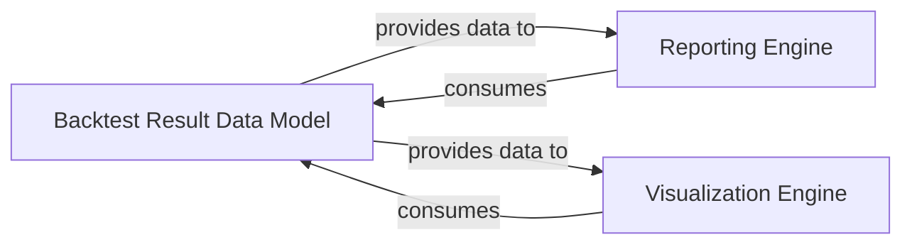

## Details

The `Reporting and Visualization` subsystem is crucial for evaluating the effectiveness of trading strategies by presenting backtest results in an understandable format. This subsystem is built around a central data model that encapsulates backtest outcomes, supported by dedicated engines for generating textual reports and graphical visualizations.

### Backtest Result Data Model
Encapsulates the comprehensive results of a backtest, including performance metrics, equity curves, and trade details. It provides methods for accessing and preparing this data for reporting and visualization.

**Related Classes/Methods**:

- <a href="https://github.com/pmorissette/bt/blob/master/bt/backtest.py" target="_blank" rel="noopener noreferrer">`bt.backtest.Result`</a>
- <a href="https://github.com/pmorissette/bt/blob/master/bt/backtest.py" target="_blank" rel="noopener noreferrer">`bt.backtest.Result:get_weights`</a>
- <a href="https://github.com/pmorissette/bt/blob/master/bt/backtest.py" target="_blank" rel="noopener noreferrer">`bt.backtest.Result:get_security_weights`</a>
- <a href="https://github.com/pmorissette/bt/blob/master/bt/backtest.py" target="_blank" rel="noopener noreferrer">`bt.backtest.Result:plot_histogram`</a>
- <a href="https://github.com/pmorissette/bt/blob/master/bt/backtest.py" target="_blank" rel="noopener noreferrer">`bt.backtest.Result:plot_weights`</a>
- <a href="https://github.com/pmorissette/bt/blob/master/bt/backtest.py" target="_blank" rel="noopener noreferrer">`bt.backtest.Result:_get_backtest`</a>

### Reporting Engine
Responsible for generating structured, often textual, reports from the backtest results. This includes detailed tables of performance statistics, monthly returns, and other analytical summaries.

**Related Classes/Methods**:

- `bt.report`

### Visualization Engine
Handles the graphical representation of backtest results, producing charts such as equity curves, drawdowns, histograms, and weight allocations. It leverages plotting libraries to create insightful visual analyses.

**Related Classes/Methods**:

- `bt.chart`

### [FAQ](https://github.com/CodeBoarding/GeneratedOnBoardings/tree/main?tab=readme-ov-file#faq)