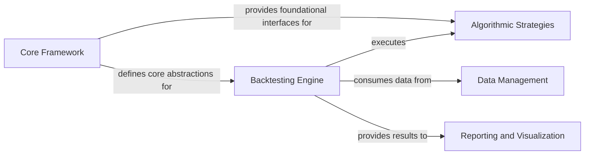

## Details

Abstract Components Overview

### Core Framework [[Expand]](./Core_Framework.md)
Establishes the foundational abstract definitions and building blocks for strategies, financial instruments (securities), and the execution flow of algorithms. It defines the base classes and interfaces that other components extend and utilize, ensuring a consistent structure for backtesting elements.

**Related Classes/Methods**:

- <a href="https://github.com/pmorissette/bt/blob/master/bt/core.py" target="_blank" rel="noopener noreferrer">`bt.core.Node`</a>
- <a href="https://github.com/pmorissette/bt/blob/master/bt/core.py" target="_blank" rel="noopener noreferrer">`bt.core.StrategyBase`</a>
- <a href="https://github.com/pmorissette/bt/blob/master/bt/core.py" target="_blank" rel="noopener noreferrer">`bt.core.Strategy`</a>
- <a href="https://github.com/pmorissette/bt/blob/master/bt/core.py" target="_blank" rel="noopener noreferrer">`bt.core.FixedIncomeStrategy`</a>
- <a href="https://github.com/pmorissette/bt/blob/master/bt/core.py" target="_blank" rel="noopener noreferrer">`bt.core.SecurityBase`</a>
- <a href="https://github.com/pmorissette/bt/blob/master/bt/core.py" target="_blank" rel="noopener noreferrer">`bt.core.FixedIncomeSecurity`</a>
- <a href="https://github.com/pmorissette/bt/blob/master/bt/core.py" target="_blank" rel="noopener noreferrer">`bt.core.CouponPayingSecurity`</a>
- <a href="https://github.com/pmorissette/bt/blob/master/bt/core.py" target="_blank" rel="noopener noreferrer">`bt.core.HedgeSecurity`</a>
- <a href="https://github.com/pmorissette/bt/blob/master/bt/core.py" target="_blank" rel="noopener noreferrer">`bt.core.CouponPayingHedgeSecurity`</a>
- <a href="https://github.com/pmorissette/bt/blob/master/bt/core.py" target="_blank" rel="noopener noreferrer">`bt.core.AlgoStack`</a>

### Backtesting Engine [[Expand]](./Backtesting_Engine.md)
Orchestrates the entire backtesting simulation process. It takes defined strategies, historical data, and configuration, simulates their performance over time, and generates comprehensive results. It manages the execution flow and state of the backtest.

**Related Classes/Methods**:

- <a href="https://github.com/pmorissette/bt/blob/master/bt/backtest.py" target="_blank" rel="noopener noreferrer">`bt.backtest.Backtest`</a>
- <a href="https://github.com/pmorissette/bt/blob/master/bt/backtest.py" target="_blank" rel="noopener noreferrer">`bt.backtest.Result`</a>
- <a href="https://github.com/pmorissette/bt/blob/master/bt/backtest.py" target="_blank" rel="noopener noreferrer">`bt.backtest.RandomBenchmarkResult`</a>
- <a href="https://github.com/pmorissette/bt/blob/master/bt/backtest.py" target="_blank" rel="noopener noreferrer">`bt.backtest.RenormalizedFixedIncomeResult`</a>

### Algorithmic Strategies [[Expand]](./Algorithmic_Strategies.md)
Contains concrete, executable algorithms that define the specific actions and logic within an investment strategy. These algorithms interact with the Core Framework's definitions to perform operations such as managing periods, updating risk, rebalancing portfolios, or hedging.

**Related Classes/Methods**:

- <a href="https://github.com/pmorissette/bt/blob/master/bt/algos.py" target="_blank" rel="noopener noreferrer">`bt.algos.RunPeriod`</a>
- <a href="https://github.com/pmorissette/bt/blob/master/bt/algos.py" target="_blank" rel="noopener noreferrer">`bt.algos.UpdateRisk`</a>
- <a href="https://github.com/pmorissette/bt/blob/master/bt/algos.py" target="_blank" rel="noopener noreferrer">`bt.algos.HedgeRisks`</a>

### Data Management [[Expand]](./Data_Management.md)
Handles the ingestion, processing, and provision of historical financial data to the Backtesting Engine. This component is responsible for ensuring data quality, alignment, and availability for strategy execution.

**Related Classes/Methods**:

- <a href="https://github.com/pmorissette/bt/blob/master/bt/backtest.py" target="_blank" rel="noopener noreferrer">`bt.backtest.Backtest`</a>

### Reporting and Visualization [[Expand]](./Reporting_and_Visualization.md)
Provides functionalities for generating comprehensive reports and visualizations of backtest results. This includes performance metrics, equity curves, drawdowns, and other analytical insights to evaluate strategy effectiveness.

**Related Classes/Methods**:

- <a href="https://github.com/pmorissette/bt/blob/master/bt/backtest.py" target="_blank" rel="noopener noreferrer">`bt.backtest.Result`</a>

### [FAQ](https://github.com/CodeBoarding/GeneratedOnBoardings/tree/main?tab=readme-ov-file#faq)