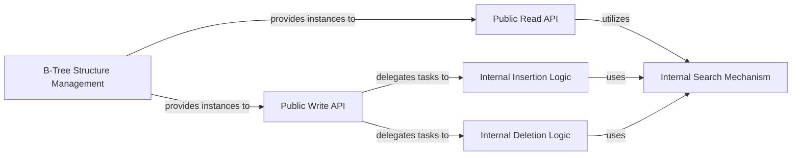

## Details

The `btree` subsystem provides an in-memory B-Tree implementation. Its architecture is structured around a central `BTree` type, which encapsulates the tree's state and exposes public APIs for data manipulation and retrieval. Internal operations, such as searching, insertion, and deletion, are handled by specialized methods on the `node`, `items`, and `children` types, ensuring the B-tree's structural integrity and balance. The system is initialized through dedicated constructor functions, and its operational components interact to manage the tree's dynamic nature.

### B-Tree Structure Management
This component is responsible for the fundamental structure and state of the B-tree, including managing the root node and the tree's degree. It provides the constructors for initializing new B-tree instances.

**Related Classes/Methods**:

- `btree.New`
- `btree.NewWithFreeList`
- `btree.BTree`

### Public Read API
Offers the external interface for querying the B-tree without modifying its structure. This includes methods for retrieving specific elements and for iterating through the tree's contents in sorted order.

**Related Classes/Methods**:

- `(*btree.BTree).Get`
- `(*btree.BTree).Ascend`
- `(*btree.BTree).Descend`

### Public Write API
Provides the external interface for modifying the B-tree's contents. This component handles requests for inserting new elements and deleting existing ones, acting as the entry point for all tree modifications.

**Related Classes/Methods**:

- `(*btree.BTree).Put`
- `(*btree.BTree).Delete`

### Internal Search Mechanism
Implements the core algorithm for navigating the B-tree to locate specific keys or the appropriate position for insertion/deletion. This is a foundational utility used by all other operational components.

**Related Classes/Methods**:

- `(btree.items).find`

### Internal Insertion Logic
Encapsulates the complex algorithms for adding new elements to the B-tree, including handling node splits, key/value placement, and ensuring the tree remains balanced according to B-tree properties.

**Related Classes/Methods**:

- `(btree.items).insertAt`
- `(btree.children).insertAt`
- `(*btree.node).split`
- `(*btree.node).maybeSplitChild`

### Internal Deletion Logic
Manages the intricate process of removing elements from the B-tree, including handling node underflow, merging nodes, and rebalancing the tree to maintain its structural integrity.

**Related Classes/Methods**:

- `(btree.items).removeAt`
- `(btree.children).removeAt`
- `(btree.items).pop`
- `(btree.children).pop`

### [FAQ](https://github.com/CodeBoarding/GeneratedOnBoardings/tree/main?tab=readme-ov-file#faq)