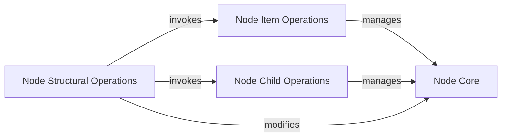

## Details

The `btree` subsystem is built around the `Node Core`, which represents individual nodes in the B-tree. The `Node Item Operations` and `Node Child Operations` components provide the fundamental capabilities for managing the data items and child pointers within these nodes, respectively. The `Node Structural Operations` component orchestrates more complex, tree-maintaining actions such as node splitting and ensuring copy-on-write semantics. This modular design allows for clear separation of concerns, with specialized components handling specific aspects of node management and tree balancing.

### Node Core
This component represents the fundamental building block of the B-tree—a single node. It encapsulates the ordered collection of `Item`s (key-value pairs) and references to its child nodes. It serves as the foundational element upon which all node operations are performed.

**Related Classes/Methods**:

- `btree.node`

### Node Item Operations
This component is responsible for managing the collection of `Item`s stored within a B-tree node. It provides the low-level primitives for manipulating these items, ensuring they remain sorted and within the node's capacity.

**Related Classes/Methods**:

- `items.insertAt`
- `items.removeAt`
- `items.pop`
- `items.truncate`
- `items.find`

### Node Child Operations
This component manages the references to child nodes within an internal B-tree node. It provides the necessary operations to insert, remove, and truncate these child pointers, which are crucial for maintaining the tree's hierarchical structure.

**Related Classes/Methods**:

- `children.insertAt`
- `children.removeAt`
- `children.pop`
- `children.truncate`

### Node Structural Operations
This component handles the complex structural modifications required for a B-tree node, including ensuring mutability for copy-on-write semantics and performing node splitting when a node becomes overfull. It is vital for maintaining the B-tree's balanced and efficient structure during insertions.

**Related Classes/Methods**:

- `node.mutableFor`
- `node.mutableChild`
- `node.split`
- `node.maybeSplitChild`

### [FAQ](https://github.com/CodeBoarding/GeneratedOnBoardings/tree/main?tab=readme-ov-file#faq)