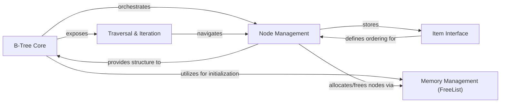

## Details

The btree project implements an in-memory B-Tree data structure, designed for efficient ordered data storage and retrieval. The core of the system is the B-Tree Core component, which manages the overall tree structure and exposes the primary API for interactions such as insertion, deletion, and retrieval. This component relies heavily on Node Management, which handles the internal representation and manipulation of individual B-tree nodes, including their items and child references. Data elements stored within the tree must conform to the Item Interface, ensuring proper ordering through its Less method. To optimize performance and reduce garbage collection overhead, the system incorporates a Memory Management (FreeList) component, responsible for the efficient allocation and deallocation of nodes. Finally, the Traversal & Iteration component provides various methods for navigating the tree's elements in a sorted manner, enabling ordered access to data. The B-Tree Core orchestrates operations by interacting with Node Management, which in turn utilizes the Item Interface for data comparison and Memory Management for node lifecycle. Traversal & Iteration functions also interact with the B-Tree Core to navigate the tree structure.

### B-Tree Core [[Expand]](./B_Tree_Core.md)
The primary entry point and orchestrator of the B-tree. Manages the tree's root, degree, and overall state, exposing the public API for tree operations.

**Related Classes/Methods**:

- `btree.BTree`
- `btree.New`
- `btree.NewWithFreeList`
- `btree.BTree.Get`
- `btree.BTree.Put`
- `btree.BTree.Delete`
- `btree.BTree.Ascend`
- `btree.BTree.Descend`

### Node Management [[Expand]](./Node_Management.md)
Represents the fundamental building blocks (nodes) of the B-tree. Handles internal node logic, including item storage, child references, and operations like splitting and ensuring mutability for copy-on-write.

**Related Classes/Methods**:

- `btree.node`
- `btree.items.insertAt`
- `btree.items.removeAt`
- `btree.items.pop`
- `btree.items.truncate`
- `btree.items.find`
- `btree.children.insertAt`
- `btree.children.removeAt`
- `btree.children.pop`
- `btree.children.truncate`
- `btree.node.mutableFor`
- `btree.node.mutableChild`
- `btree.node.split`
- `btree.node.maybeSplitChild`

### Item Interface
Defines the contract for data elements stored within the B-tree, requiring a Less method to establish a strict weak ordering for all items.

**Related Classes/Methods**:

- `btree.Item`
- `btree.Item.Less`

### Memory Management (FreeList)
Provides an efficient mechanism for managing the allocation and deallocation of node objects, reducing garbage collection overhead by reusing freed nodes.

**Related Classes/Methods**:

- `btree.FreeList`
- `btree.NewFreeList`
- `btree.FreeList.newNode`
- `btree.FreeList.freeNode`

### Traversal & Iteration
Offers mechanisms for traversing the B-tree's elements in a sorted manner (ascending or descending) using callback functions, allowing for flexible iteration over subsets of the tree.

**Related Classes/Methods**:

- `btree.ItemIterator`
- `btree.BTree.Ascend`
- `btree.BTree.Descend`
- `btree.BTree.AscendGreaterOrEqual`
- `btree.BTree.AscendLessThan`
- `btree.BTree.AscendRange`
- `btree.BTree.DescendLessOrEqual`
- `btree.BTree.DescendRange`

### [FAQ](https://github.com/CodeBoarding/GeneratedOnBoardings/tree/main?tab=readme-ov-file#faq)