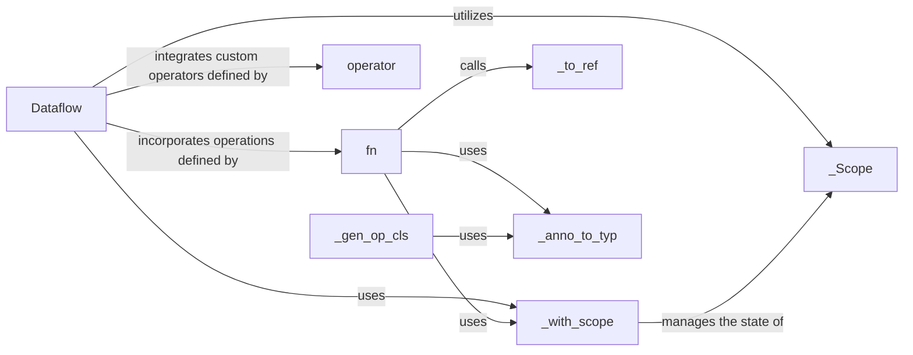

## Details

The `Dataflow Definition API` subsystem is responsible for providing the programmatic interface for users to construct and define real-time data processing pipelines within the Bytewax framework. It focuses on the declarative definition of dataflow graphs, allowing users to specify data sources, transformations, and sinks.

### Dataflow
Serves as the top-level container and builder for a stream processing pipeline. Users instantiate `Dataflow` to begin defining their pipeline, adding various operations to it. It manages the overall structure and state of the dataflow graph, acting as the conceptual representation of the entire pipeline.

**Related Classes/Methods**:

- <a href="https://github.com/bytewax/bytewax/blob/main/pysrc/bytewax/run.py#L30-L117" target="_blank" rel="noopener noreferrer">`Dataflow`:30-117</a>

### fn
Provides a straightforward, user-facing function/decorator for defining individual, atomic dataflow steps or transformations. It allows users to specify the processing logic for data by wrapping a Python function into a dataflow operation.

**Related Classes/Methods**:

- <a href="https://github.com/bytewax/bytewax/blob/main/pysrc/bytewax/outputs.py#L100-L127" target="_blank" rel="noopener noreferrer">`fn`:100-127</a>

### operator
A user-facing decorator that enables the definition of custom, reusable dataflow operators. It allows users to encapsulate a sequence of operations or a more complex processing logic into a single, reusable component, extending the framework's built-in capabilities.

**Related Classes/Methods**:

- <a href="https://github.com/bytewax/bytewax/blob/main/pysrc/bytewax/dataflow.py#L697-L715" target="_blank" rel="noopener noreferrer">`operator`:697-715</a>

### _Scope
Manages the hierarchical context and nesting of operations within the dataflow, crucial for maintaining structural integrity and enabling nested dataflow definitions.

**Related Classes/Methods**:

- <a href="https://github.com/bytewax/bytewax/blob/main/stubgen.py#L51-L56" target="_blank" rel="noopener noreferrer">`_Scope`:51-56</a>

### _with_scope
A context manager that facilitates entering and exiting specific operational scopes, ensuring correct context for dataflow operations and proper graph construction within nested structures.

**Related Classes/Methods**:

- <a href="https://github.com/bytewax/bytewax/blob/main/pysrc/bytewax/dataflow.py#L328-L332" target="_blank" rel="noopener noreferrer">`_with_scope`:328-332</a>

### _to_ref
Converts various dataflow elements (like ports and IDs) into internal references, essential for building the dataflow's directed acyclic graph (DAG) representation and linking operations.

**Related Classes/Methods**:

- <a href="https://github.com/bytewax/bytewax/blob/main/pysrc/bytewax/dataflow.py#L334-L338" target="_blank" rel="noopener noreferrer">`_to_ref`:334-338</a>

### _gen_op_cls
Dynamically generates the Python class representation for a dataflow operator, based on user definitions and type annotations, enabling the runtime creation of operator types.

**Related Classes/Methods**:

- <a href="https://github.com/bytewax/bytewax/blob/main/pysrc/bytewax/dataflow.py#L427-L518" target="_blank" rel="noopener noreferrer">`_gen_op_cls`:427-518</a>

### _anno_to_typ
Processes Python type annotations to determine the types of inputs and outputs for dataflow operations and operators, crucial for type checking and internal graph validation.

**Related Classes/Methods**:

- <a href="https://github.com/bytewax/bytewax/blob/main/pysrc/bytewax/dataflow.py#L344-L355" target="_blank" rel="noopener noreferrer">`_anno_to_typ`:344-355</a>

### [FAQ](https://github.com/CodeBoarding/GeneratedOnBoardings/tree/main?tab=readme-ov-file#faq)