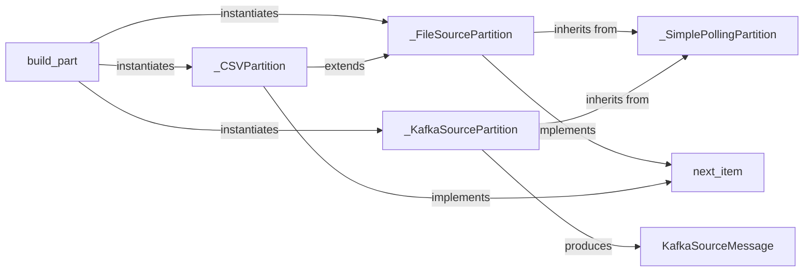

## Details

The input subsystem of `bytewax` is designed around a flexible "Connector/Plugin Architecture" centered on the `build_part` factory function. This function is responsible for instantiating various input partition types, such as `_FileSourcePartition`, `_CSVPartition`, and `_KafkaSourcePartition`, abstracting the specifics of data ingestion. All concrete partition implementations inherit from `_SimplePollingPartition`, providing a common foundation for resumable, stateful data processing. The `next_item` interface ensures a uniform mechanism for the dataflow engine to consume individual data items from any source. Specifically, `_KafkaSourcePartition` handles real-time stream processing by fetching message batches and encapsulating them as `KafkaSourceMessage` objects, demonstrating the system's capability to integrate diverse data sources seamlessly.

### build_part
This function acts as the central factory for creating input partitions. It abstracts the specifics of different input sources, managing their lifecycle, including snapshotting and resuming. It embodies the "Connector/Plugin Architecture" by providing a unified entry point for diverse input types.

**Related Classes/Methods**:

- <a href="https://github.com/bytewax/bytewax/blob/main/docs/tutorials/orderbook-guide/orderbook_dataflow.py#L132-L147" target="_blank" rel="noopener noreferrer">`build_part`:132-147</a>

### _SimplePollingPartition
A foundational, resumable base class for polling data from an input source. It provides the core mechanism for stateful data ingestion, supporting the ability to resume processing from a previous state.

**Related Classes/Methods**:

- <a href="https://github.com/bytewax/bytewax/blob/main/pysrc/bytewax/inputs.py#L285-L330" target="_blank" rel="noopener noreferrer">`_SimplePollingPartition`:285-330</a>

### next_item
This represents the generic interface for retrieving the next single data item from any input partition. It ensures uniform consumption of data by the dataflow engine, regardless of the underlying source.

**Related Classes/Methods**:

- <a href="https://github.com/bytewax/bytewax/blob/main/examples/batch_operator.py#L27-L28" target="_blank" rel="noopener noreferrer">`next_item`:27-28</a>

### _FileSourcePartition
A concrete implementation for reading raw data from a specific file partition. It handles file-specific I/O operations, serving as a fundamental "Input Connector" for batch or file-based stream processing.

**Related Classes/Methods**:

- <a href="https://github.com/bytewax/bytewax/blob/main/pysrc/bytewax/connectors/files.py#L37-L55" target="_blank" rel="noopener noreferrer">`_FileSourcePartition`:37-55</a>

### _CSVPartition
A specialized concrete implementation that extends `_FileSourcePartition` to read and parse CSV formatted data. It adds parsing logic on top of raw file reading, demonstrating the framework's capability to handle structured data formats.

**Related Classes/Methods**:

- <a href="https://github.com/bytewax/bytewax/blob/main/pysrc/bytewax/connectors/files.py#L202-L228" target="_blank" rel="noopener noreferrer">`_CSVPartition`:202-228</a>

### _KafkaSourcePartition
A critical concrete implementation for connecting to Kafka and consuming messages from assigned topic partitions. It internally uses a `next_batch` mechanism to fetch batches of messages, which are then encapsulated as `KafkaSourceMessage` objects for consistent processing. This is essential for real-time "Stream Processing."

**Related Classes/Methods**:

- <a href="https://github.com/bytewax/bytewax/blob/main/pysrc/bytewax/connectors/kafka/__init__.py#L179-L303" target="_blank" rel="noopener noreferrer">`_KafkaSourcePartition`:179-303</a>

### [FAQ](https://github.com/CodeBoarding/GeneratedOnBoardings/tree/main?tab=readme-ov-file#faq)