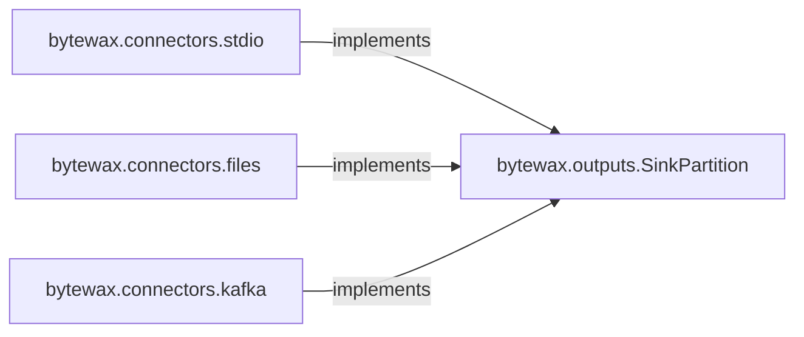

## Details

Analysis of the 'Output Connectors' subsystem in Bytewax, focusing on its plugin-like architecture for data egress.

### bytewax.outputs.SinkPartition
The foundational abstract interface for all output sinks. It defines the contract for how data batches are written, ensuring a consistent API for diverse external systems. All concrete sink implementations must adhere to this interface.

**Related Classes/Methods**:

- <a href="https://github.com/bytewax/bytewax/blob/main/pysrc/bytewax/outputs.py" target="_blank" rel="noopener noreferrer">`bytewax.outputs.SinkPartition`</a>

### bytewax.connectors.stdio
This module provides the necessary components and configuration for writing processed data to standard output (console). It encapsulates the concrete `_PrintSinkPartition` implementation, which handles the actual writing of data batches to `stdout`.

**Related Classes/Methods**:

- <a href="https://github.com/bytewax/bytewax/blob/main/pysrc/bytewax/connectors/stdio.py#L10-L17" target="_blank" rel="noopener noreferrer">`bytewax.connectors.stdio._PrintSinkPartition`:10-17</a>

### bytewax.connectors.files
This module facilitates the creation and configuration of sinks for writing processed data to local or distributed file systems. It encapsulates the concrete `_FileSinkPartition` implementation, managing file operations for data egress.

**Related Classes/Methods**:

- <a href="https://github.com/bytewax/bytewax/blob/main/pysrc/bytewax/connectors/files.py#L325-L347" target="_blank" rel="noopener noreferrer">`bytewax.connectors.files._FileSinkPartition`:325-347</a>

### bytewax.connectors.kafka
This module is dedicated to connecting Bytewax dataflows to Apache Kafka. It provides functionality for creating and configuring sinks that publish processed data as messages to Kafka topics, including handling message serialization and structuring via `KafkaSinkMessage`. It encapsulates the concrete `_KafkaSinkPartition` implementation.

**Related Classes/Methods**:

- <a href="https://github.com/bytewax/bytewax/blob/main/pysrc/bytewax/connectors/kafka/__init__.py" target="_blank" rel="noopener noreferrer">`bytewax.connectors.kafka._KafkaSinkPartition`</a>
- <a href="https://github.com/bytewax/bytewax/blob/main/pysrc/bytewax/connectors/kafka/__init__.py" target="_blank" rel="noopener noreferrer">`bytewax.connectors.kafka.KafkaSinkMessage`</a>

### [FAQ](https://github.com/CodeBoarding/GeneratedOnBoardings/tree/main?tab=readme-ov-file#faq)