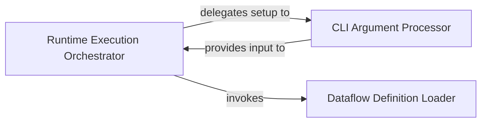

## Details

The Runtime Execution Engine subsystem is responsible for initiating and managing dataflow execution within the `bytewax.run` module.

### Runtime Execution Orchestrator
The core component responsible for orchestrating the entire dataflow execution process. It acts as the main entry point, coordinating the setup, validation, and initiation of the dataflow across the distributed or local environment.

**Related Classes/Methods**:

- <a href="https://github.com/bytewax/bytewax/blob/main/pysrc/bytewax/run.py" target="_blank" rel="noopener noreferrer">`bytewax.run`</a>

### CLI Argument Processor
Handles the definition and parsing of command-line arguments. This component is crucial for configuring the runtime environment and specifying the dataflow to be executed, acting as the interface for user input.

**Related Classes/Methods**:

- <a href="https://github.com/bytewax/bytewax/blob/main/pysrc/bytewax/run.py#L197-L247" target="_blank" rel="noopener noreferrer">`bytewax.run._create_arg_parser`:197-247</a>
- <a href="https://github.com/bytewax/bytewax/blob/main/pysrc/bytewax/run.py#L250-L325" target="_blank" rel="noopener noreferrer">`bytewax.run._parse_args`:250-325</a>

### Dataflow Definition Loader
Responsible for locating, importing, and validating the user-defined dataflow. It ensures that the specified dataflow is correctly identified and prepared for the execution engine, including handling scenarios where the dataflow cannot be found or is improperly defined.

**Related Classes/Methods**:

- <a href="https://github.com/bytewax/bytewax/blob/main/pysrc/bytewax/run.py#L30-L117" target="_blank" rel="noopener noreferrer">`bytewax.run._locate_dataflow`:30-117</a>
- <a href="https://github.com/bytewax/bytewax/blob/main/pysrc/bytewax/run.py#L120-L137" target="_blank" rel="noopener noreferrer">`bytewax.run._called_with_wrong_args`:120-137</a>

### [FAQ](https://github.com/CodeBoarding/GeneratedOnBoardings/tree/main?tab=readme-ov-file#faq)