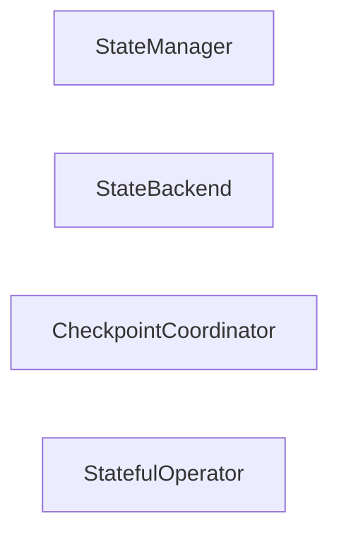

## Details

One paragraph explaining the functionality which is represented by this graph. What the main flow is and what is its purpose.

### StateManager
Manages the overall state of the dataflow, including recovery and persistence.

**Related Classes/Methods**:

### StateBackend
Handles the underlying storage and retrieval of state.

**Related Classes/Methods**:

### CheckpointCoordinator
Orchestrates the saving of state for fault tolerance.

**Related Classes/Methods**:

### StatefulOperator
An operator that maintains and updates state during data processing.

**Related Classes/Methods**:

- <a href="https://github.com/bytewax/bytewax/blob/main/pysrc/bytewax/operators/__init__.py" target="_blank" rel="noopener noreferrer">`bytewax.operators`</a>

### [FAQ](https://github.com/CodeBoarding/GeneratedOnBoardings/tree/main?tab=readme-ov-file#faq)