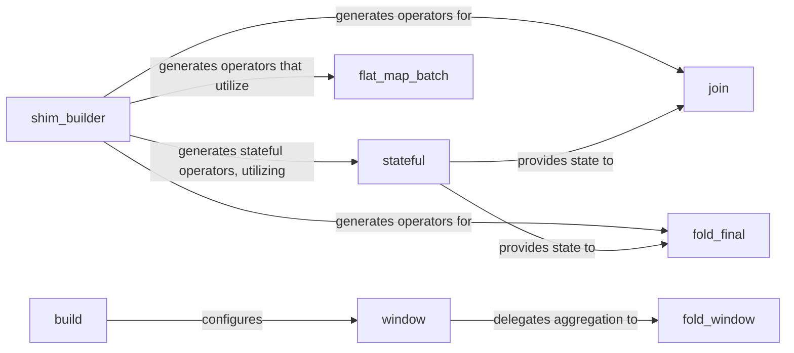

## Details

The `bytewax.operators` subsystem is central to defining and executing stream transformations. It comprises core primitives like `flat_map_batch` for efficient stateless processing and mechanisms for managing persistent state through the `stateful` component. The `shim_builder` acts as a versatile factory, responsible for constructing the internal logic of various complex operators, including those requiring state management (like joins and folds) and those that can leverage batch processing. The windowing components (`build`, `window`, `fold_window`) provide robust capabilities for time-based or event-based aggregations, with `build` configuring windowing strategies, `window` orchestrating the window lifecycle, and `fold_window` performing aggregations within these defined windows. This modular design allows for flexible and efficient stream processing, separating concerns between stateless transformations, state management, operator construction, and window-specific aggregations.

### shim_builder
A versatile factory responsible for constructing the internal logic of various operators, including those for folds, collects, stateful flat maps, and joins. It abstracts the complexity of creating operator-specific processing units.

**Related Classes/Methods**: _None_

### stateful
Manages persistent state across data elements, enabling stateful stream transformations. It provides the underlying mechanism for operators that require memory of past events or accumulated results.

**Related Classes/Methods**: _None_

### flat_map_batch
A core primitive that many stateless transformations (e.g., map, filter, flatten) delegate to for efficient batch processing. It handles the application of a function to each element in a batch, potentially producing multiple output elements.

**Related Classes/Methods**:

- <a href="https://github.com/bytewax/bytewax/blob/main/pysrc/bytewax/operators/__init__.py#L180-L237" target="_blank" rel="noopener noreferrer">`bytewax.operators.flat_map_batch`:180-237</a>

### join
Manages the complex operation of combining two or more data streams based on a common key, often involving state management to buffer and match elements.

**Related Classes/Methods**: _None_

### fold_final
Performs aggregations over an entire stream, producing a single final result once the stream is complete or a specific condition is met.

**Related Classes/Methods**: _None_

### window
The central orchestrator within the windowing module that applies the defined windowing logic to incoming data. It manages the lifecycle of windows, including their creation, processing, and emission of results.

**Related Classes/Methods**:

- <a href="https://github.com/bytewax/bytewax/blob/main/pysrc/bytewax/operators/windowing.py#L1254-L1338" target="_blank" rel="noopener noreferrer">`bytewax.operators.windowing.window`:1254-1338</a>

### build
The primary entry point for configuring and instantiating different windowing strategies (e.g., sliding, session, event-time, system-time).

**Related Classes/Methods**:

- <a href="https://github.com/bytewax/bytewax/blob/main/pysrc/bytewax/operators/windowing.py#L945-L950" target="_blank" rel="noopener noreferrer">`bytewax.operators.windowing.build`:945-950</a>

### fold_window
Performs aggregations specifically within the boundaries of defined windows, accumulating results per window.

**Related Classes/Methods**:

- <a href="https://github.com/bytewax/bytewax/blob/main/pysrc/bytewax/operators/windowing.py#L1717-L1846" target="_blank" rel="noopener noreferrer">`bytewax.operators.windowing.fold_window`:1717-1846</a>

### [FAQ](https://github.com/CodeBoarding/GeneratedOnBoardings/tree/main?tab=readme-ov-file#faq)