```mermaid
graph LR
    Dataflow_Definition_API["Dataflow Definition API"]
    Input_Connectors["Input Connectors"]
    Output_Connectors["Output Connectors"]
    Stream_Processing_Core["Stream Processing Core"]
    State_Management_Recovery["State Management & Recovery"]
    Runtime_Execution_Engine["Runtime Execution Engine"]
    Dataflow_Definition_API -- "Defines/Configures" --> Input_Connectors
    Dataflow_Definition_API -- "Defines/Composes" --> Stream_Processing_Core
    Dataflow_Definition_API -- "Defines/Configures" --> Output_Connectors
    Dataflow_Definition_API -- "Provides Definition To" --> Runtime_Execution_Engine
    Input_Connectors -- "Feeds Data To" --> Runtime_Execution_Engine
    Runtime_Execution_Engine -- "Orchestrates Execution Of" --> Stream_Processing_Core
    Stream_Processing_Core -- "Reads/Writes State" --> State_Management_Recovery
    Stream_Processing_Core -- "Sends Processed Data To" --> Output_Connectors
    State_Management_Recovery -- "Provides State Persistence For" --> Stream_Processing_Core
    click Dataflow_Definition_API href "https://github.com/CodeBoarding/GeneratedOnBoardings/blob/main/bytewax/Dataflow_Definition_API.md" "Details"
    click Input_Connectors href "https://github.com/CodeBoarding/GeneratedOnBoardings/blob/main/bytewax/Input_Connectors.md" "Details"
    click Output_Connectors href "https://github.com/CodeBoarding/GeneratedOnBoardings/blob/main/bytewax/Output_Connectors.md" "Details"
    click Stream_Processing_Core href "https://github.com/CodeBoarding/GeneratedOnBoardings/blob/main/bytewax/Stream_Processing_Core.md" "Details"
    click State_Management_Recovery href "https://github.com/CodeBoarding/GeneratedOnBoardings/blob/main/bytewax/State_Management_Recovery.md" "Details"
    click Runtime_Execution_Engine href "https://github.com/CodeBoarding/GeneratedOnBoardings/blob/main/bytewax/Runtime_Execution_Engine.md" "Details"
```

## Details

The Bytewax architecture is centered around a robust, distributed stream processing model. Users interact with the Dataflow Definition API to construct data pipelines, specifying how data flows from Input Connectors through a series of transformations within the Stream Processing Core, and finally to Output Connectors. The Runtime Execution Engine is the backbone, responsible for orchestrating the entire dataflow execution across a cluster, ensuring efficient data distribution and fault tolerance. Critical to maintaining data consistency and enabling recovery is the State Management & Recovery component, which provides persistent storage for the internal state of stream operators. This design emphasizes a clear, linear data flow from ingestion to egress, supported by a resilient execution and state management infrastructure, making it ideal for real-time data processing and analytics.

### Dataflow Definition API [[Expand]](./Dataflow_Definition_API.md)
The user-facing Python API for programmatically constructing and defining real-time data processing pipelines.

**Related Classes/Methods**:

- <a href="https://github.com/bytewax/bytewax/blob/main/pysrc/bytewax/dataflow.py" target="_blank" rel="noopener noreferrer">`bytewax.dataflow`</a>

### Input Connectors [[Expand]](./Input_Connectors.md)
Components responsible for ingesting raw data from diverse external sources (e.g., Kafka, files, standard input) into the Bytewax dataflow.

**Related Classes/Methods**:

- <a href="https://github.com/bytewax/bytewax/blob/main/pysrc/bytewax/inputs.py" target="_blank" rel="noopener noreferrer">`bytewax.inputs`</a>
- <a href="https://github.com/bytewax/bytewax/blob/main/pysrc/bytewax/connectors/" target="_blank" rel="noopener noreferrer">`bytewax.connectors`</a>

### Output Connectors [[Expand]](./Output_Connectors.md)
Components managing the egress of processed data from the Bytewax dataflow to various external sinks (e.g., Kafka, files, standard output).

**Related Classes/Methods**:

- <a href="https://github.com/bytewax/bytewax/blob/main/pysrc/bytewax/outputs.py" target="_blank" rel="noopener noreferrer">`bytewax.outputs`</a>
- <a href="https://github.com/bytewax/bytewax/blob/main/pysrc/bytewax/connectors/" target="_blank" rel="noopener noreferrer">`bytewax.connectors`</a>

### Stream Processing Core [[Expand]](./Stream_Processing_Core.md)
The central component encompassing all stateless and stateful transformations, aggregations, and windowing operations applied to data streams.

**Related Classes/Methods**:

- <a href="https://github.com/bytewax/bytewax/blob/main/pysrc/bytewax/operators/" target="_blank" rel="noopener noreferrer">`bytewax.operators`</a>
- <a href="https://github.com/bytewax/bytewax/blob/main/pysrc/bytewax/operators/windowing.py" target="_blank" rel="noopener noreferrer">`bytewax.operators.windowing`</a>

### State Management & Recovery [[Expand]](./State_Management_Recovery.md)
Provides the underlying mechanisms for operators to maintain and recover their internal state across processing steps, machine restarts, and failures, ensuring fault tolerance.

**Related Classes/Methods**:

- <a href="https://github.com/bytewax/bytewax/blob/main/pysrc/bytewax/recovery.py" target="_blank" rel="noopener noreferrer">`bytewax.recovery`</a>

### Runtime Execution Engine [[Expand]](./Runtime_Execution_Engine.md)
The core distributed execution engine responsible for loading, distributing, and running the defined dataflows across a cluster or locally.

**Related Classes/Methods**:

- <a href="https://github.com/bytewax/bytewax/blob/main/pysrc/bytewax/run.py" target="_blank" rel="noopener noreferrer">`bytewax.run`</a>

### [FAQ](https://github.com/CodeBoarding/GeneratedOnBoardings/tree/main?tab=readme-ov-file#faq)