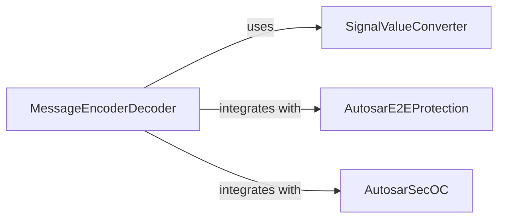

## Details

The `cantools` project's core functionality for CAN message processing is centered around the `MessageEncoderDecoder` component. This component serves as the central hub for transforming raw CAN frame data into meaningful signal values and vice-versa. It leverages the `SignalValueConverter` to handle the intricate details of signal value scaling and conversion between raw and physical representations. Furthermore, for robust and secure communication, the `MessageEncoderDecoder` integrates with `AutosarE2EProtection` to ensure data integrity through CRC checks and with `AutosarSecOC` for message authenticity and integrity via authenticators. This architecture ensures a clear separation of concerns, with dedicated components for message encoding/decoding, signal value conversion, and AUTOSAR-specific security mechanisms, all orchestrated by the `MessageEncoderDecoder`.

### MessageEncoderDecoder
This component acts as the primary orchestrator for the encoding of Python dictionaries (representing signal values) into raw CAN frame bytes and the decoding of raw CAN frame bytes back into meaningful signal values. It is responsible for managing the overall message structure, handling complex scenarios like multiplexed signals, and validating whether data can be successfully encoded or decoded according to the CAN database definitions.

**Related Classes/Methods**:

### SignalValueConverter
This component provides the fundamental logic for converting signal values. It handles the transformation between the raw integer representation of a signal (as it appears in a CAN frame) and its scaled physical representation (e.g., engineering units like degrees Celsius or meters per second). It supports various conversion types, including linear scaling, named value mappings, and identity transformations.

**Related Classes/Methods**:

- <a href="https://github.com/cantools/cantools/blob/master/src/cantools/database/conversion.py" target="_blank" rel="noopener noreferrer">`cantools.database.conversion.SignalValueConverter`</a>

### AutosarE2EProtection
This component implements AUTOSAR End-to-End (E2E) protection mechanisms. Its primary responsibility is to compute, apply, and verify Cyclic Redundancy Checks (CRCs) for data integrity, specifically supporting profiles like Profile 2 and Profile 5. This ensures the reliability of data transmitted over the CAN bus.

**Related Classes/Methods**:

- <a href="https://github.com/cantools/cantools/blob/master/src/cantools/autosar/end_to_end.py" target="_blank" rel="noopener noreferrer">`cantools.autosar.end_to_end.AutosarE2EProtection`</a>

### AutosarSecOC
This component provides functionalities for AUTOSAR Secure Onboard Communication (SecOC). It is responsible for computing, applying, and verifying authenticators to ensure the authenticity and integrity of CAN messages. This helps protect against unauthorized message manipulation or injection.

**Related Classes/Methods**:

- <a href="https://github.com/cantools/cantools/blob/master/src/cantools/autosar/secoc.py" target="_blank" rel="noopener noreferrer">`cantools.autosar.secoc.AutosarSecOC`</a>

### [FAQ](https://github.com/CodeBoarding/GeneratedOnBoardings/tree/main?tab=readme-ov-file#faq)