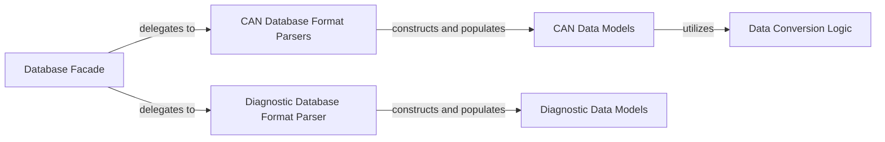

## Details

The `cantools.database` subsystem provides a robust framework for interacting with various automotive communication and diagnostic database formats. The `Database Facade` acts as the central orchestrator, offering a unified interface for loading and managing database files. It delegates parsing and serialization tasks to specialized `CAN Database Format Parsers` and the `Diagnostic Database Format Parser`, each handling specific file types like DBC, KCD, SYM, ARXML, and CDD. These parsers are responsible for transforming raw file data into structured in-memory representations, which are managed by the `CAN Data Models` and `Diagnostic Data Models`. The `Data Conversion Logic` component underpins these data models, providing essential utilities for converting raw signal values to their engineering units and vice-versa, ensuring accurate data interpretation. This modular design allows for easy extension to support new formats while maintaining a clear separation of concerns.

### Database Facade
The primary entry point for loading and dumping various database formats (DBC, KCD, SYM, ARXML, CDD). It provides a high-level interface, abstracting the underlying format-specific parsing and serialization logic, acting as a dispatcher to the appropriate format handlers.

**Related Classes/Methods**:

- <a href="https://github.com/cantools/cantools/blob/master/src/cantools/database/__init__.py#L1-L100" target="_blank" rel="noopener noreferrer">`cantools.database.__init__`:1-100</a>

### CAN Data Models
Comprising `cantools.database.can.database.Database`, `cantools.database.can.message.Message`, and `cantools.database.can.signal.Signal`, this component defines the structured in-memory representation of a CAN database. It manages messages, signals, and their properties, enabling encoding of raw data into CAN frames and decoding frames into signal values.

**Related Classes/Methods**:

- <a href="https://github.com/cantools/cantools/blob/master/src/cantools/database/can/database.py" target="_blank" rel="noopener noreferrer">`cantools.database.can.database.Database`</a>
- <a href="https://github.com/cantools/cantools/blob/master/src/cantools/database/can/message.py#L48-L1324" target="_blank" rel="noopener noreferrer">`cantools.database.can.message.Message`:48-1324</a>
- <a href="https://github.com/cantools/cantools/blob/master/src/cantools/database/can/signal.py#L11-L297" target="_blank" rel="noopener noreferrer">`cantools.database.can.signal.Signal`:11-297</a>

### Diagnostic Data Models
Consisting of `cantools.database.diagnostics.database.Database` and `cantools.database.diagnostics.did.Did`, this component provides the structured in-memory representation for diagnostic databases. It manages Diagnostic Identifiers (DIDs) and their associated data elements and decoding rules.

**Related Classes/Methods**:

- <a href="https://github.com/cantools/cantools/blob/master/src/cantools/database/diagnostics/database.py" target="_blank" rel="noopener noreferrer">`cantools.database.diagnostics.database.Database`</a>
- <a href="https://github.com/cantools/cantools/blob/master/src/cantools/database/diagnostics/did.py#L8-L140" target="_blank" rel="noopener noreferrer">`cantools.database.diagnostics.did.Did`:8-140</a>

### CAN Database Format Parsers
A set of specialized modules (`cantools.database.can.formats.dbc`, `kcd`, `sym`, `arxml`) responsible for parsing specific CAN database file formats. They read the file content and construct instances of the CAN Data Models, and can also serialize these models back into their respective file formats.

**Related Classes/Methods**:

- <a href="https://github.com/cantools/cantools/blob/master/src/cantools/database/can/formats/dbc.py#L1-L500" target="_blank" rel="noopener noreferrer">`cantools.database.can.formats.dbc`:1-500</a>
- <a href="https://github.com/cantools/cantools/blob/master/src/cantools/database/can/formats/kcd.py#L1-L300" target="_blank" rel="noopener noreferrer">`cantools.database.can.formats.kcd`:1-300</a>
- <a href="https://github.com/cantools/cantools/blob/master/src/cantools/database/can/formats/sym.py#L1-L200" target="_blank" rel="noopener noreferrer">`cantools.database.can.formats.sym`:1-200</a>
- <a href="https://github.com/cantools/cantools/blob/master/src/cantools/database/can/formats/arxml/__init__.py#L1-L100" target="_blank" rel="noopener noreferrer">`cantools.database.can.formats.arxml`:1-100</a>

### Diagnostic Database Format Parser
The dedicated module (`cantools.database.diagnostics.formats.cdd`) for parsing and serializing CDD (CANdela Diagnostic Data) files. It constructs and populates instances of the Diagnostic Data Models based on the CDD file content.

**Related Classes/Methods**:

- <a href="https://github.com/cantools/cantools/blob/master/src/cantools/database/diagnostics/formats/cdd.py#L1-L400" target="_blank" rel="noopener noreferrer">`cantools.database.diagnostics.formats.cdd`:1-400</a>

### Data Conversion Logic
Encapsulated in `cantools.database.conversion`, this component provides the fundamental algorithms for converting raw signal values to their physical units (e.g., applying scaling, offset, and value tables) and vice-versa. It is a core utility for accurate data interpretation within the data models.

**Related Classes/Methods**:

- <a href="https://github.com/cantools/cantools/blob/master/src/cantools/database/conversion.py#L1-L200" target="_blank" rel="noopener noreferrer">`cantools.database.conversion`:1-200</a>

### [FAQ](https://github.com/CodeBoarding/GeneratedOnBoardings/tree/main?tab=readme-ov-file#faq)