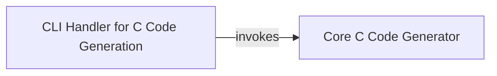

## Details

The C Code Generation subsystem within `cantools` provides a command-line interface for transforming CAN database files into C source and header files. The `CLI Handler for C Code Generation` acts as the entry point, processing user arguments and database inputs. It then delegates the core task of C code generation to the `Core C Code Generator`, which is responsible for translating the CAN database schema into structured C code, including definitions for messages, signals, and packing/unpacking functions. This clear separation of concerns allows for flexible command-line interaction and robust code generation capabilities.

### Core C Code Generator
This component encapsulates the primary logic for generating C source and header files. It translates the abstract representation of CAN messages and signals (obtained from the CAN/Diagnostic Database Management component) into concrete C data structures, function prototypes, and implementation details for packing and unpacking CAN frames. It handles data type mapping, bitfield manipulation, and formatting according to C language conventions.

**Related Classes/Methods**:

### CLI Handler for C Code Generation
This component serves as the user-facing interface for the C code generation functionality. It parses command-line arguments, loads the necessary CAN/Diagnostic database files, and orchestrates the invocation of the `Core C Code Generator` component with the appropriate parameters.

**Related Classes/Methods**:

### [FAQ](https://github.com/CodeBoarding/GeneratedOnBoardings/tree/main?tab=readme-ov-file#faq)