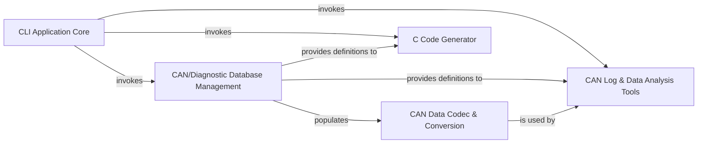

## Details

The `cantools` project is architected as a robust library for CAN (Controller Area Network) communication, featuring integrated command-line tools and a C code generator. Its core flow revolves around the transformation of CAN data, starting with the CAN/Diagnostic Database Management component, which parses various database definition files (DBC, ARXML, etc.) into structured in-memory models. These models then serve as the foundation for the CAN Data Codec & Conversion component, enabling the bidirectional translation between raw CAN frame bytes and meaningful, scaled signal values, including specialized AUTOSAR E2E/SecOC functionalities. User interaction is primarily managed by the CLI Application Core, which dispatches commands to either the C Code Generator for embedded system integration or the CAN Log & Data Analysis Tools for real-time monitoring, plotting, and comprehensive data management of CAN traffic and database contents. This clear separation ensures a modular and extensible system, where data definition, core logic, and various interaction layers are distinctly managed.

### CLI Application Core [[Expand]](./CLI_Application_Core.md)
The central command-line interface component responsible for parsing user commands and directing execution to the appropriate subcommand handler. It acts as the primary entry point for user interaction.

**Related Classes/Methods**:

- <a href="https://github.com/cantools/cantools/blob/master/src/cantools/__init__.py" target="_blank" rel="noopener noreferrer">`cantools`</a>
- <a href="https://github.com/cantools/cantools/blob/master/src/cantools/__main__.py" target="_blank" rel="noopener noreferrer">`cantools.__main__`</a>
- <a href="https://github.com/cantools/cantools/blob/master/src/cantools/subparsers/" target="_blank" rel="noopener noreferrer">`cantools.subparsers`</a>

### CAN/Diagnostic Database Management [[Expand]](./CAN_Diagnostic_Database_Management.md)
Manages the loading, parsing, and in-memory representation of CAN and diagnostic database definition files (DBC, KCD, SYM, ARXML, CDD). This component provides the structured data models for messages, signals, and DIDs.

**Related Classes/Methods**:

- <a href="https://github.com/cantools/cantools/blob/master/src/cantools/database/__init__.py" target="_blank" rel="noopener noreferrer">`cantools.database`</a>
- <a href="https://github.com/cantools/cantools/blob/master/src/cantools/database/can/" target="_blank" rel="noopener noreferrer">`cantools.database.can`</a>
- <a href="https://github.com/cantools/cantools/blob/master/src/cantools/database/diagnostics/" target="_blank" rel="noopener noreferrer">`cantools.database.diagnostics`</a>

### CAN Data Codec & Conversion [[Expand]](./CAN_Data_Codec_Conversion.md)
Handles the bidirectional transformation between raw CAN frame data (bytes) and meaningful, scaled signal values. It utilizes the definitions from the Database Management component and includes signal conversion logic, integrating AUTOSAR E2E/SecOC functionalities.

**Related Classes/Methods**:

- <a href="https://github.com/cantools/cantools/blob/master/src/cantools/database/can/message.py" target="_blank" rel="noopener noreferrer">`cantools.database.can.message`</a>
- <a href="https://github.com/cantools/cantools/blob/master/src/cantools/database/conversion.py" target="_blank" rel="noopener noreferrer">`cantools.database.conversion`</a>
- <a href="https://github.com/cantools/cantools/blob/master/src/cantools/autosar/" target="_blank" rel="noopener noreferrer">`cantools.autosar`</a>

### C Code Generator [[Expand]](./C_Code_Generator.md)
Generates C header and source files based on the definitions stored in the CAN/Diagnostic Database Management component, facilitating integration into embedded systems.

**Related Classes/Methods**:

- <a href="https://github.com/cantools/cantools/blob/master/src/cantools/database/can/c_source.py" target="_blank" rel="noopener noreferrer">`cantools.database.can.c_source`</a>
- <a href="https://github.com/cantools/cantools/blob/master/src/cantools/subparsers/generate_c_source.py" target="_blank" rel="noopener noreferrer">`cantools.subparsers.generate_c_source`</a>

### CAN Log & Data Analysis Tools
A suite of CLI-driven tools for parsing CAN log files, monitoring live CAN bus traffic, plotting signal data, and managing (listing, dumping, converting, decoding) database contents and log data.

**Related Classes/Methods**:

- <a href="https://github.com/cantools/cantools/blob/master/src/cantools/logreader.py" target="_blank" rel="noopener noreferrer">`cantools.logreader`</a>
- <a href="https://github.com/cantools/cantools/blob/master/src/cantools/subparsers/monitor.py" target="_blank" rel="noopener noreferrer">`cantools.subparsers.monitor`</a>
- <a href="https://github.com/cantools/cantools/blob/master/src/cantools/subparsers/plot.py" target="_blank" rel="noopener noreferrer">`cantools.subparsers.plot`</a>
- <a href="https://github.com/cantools/cantools/blob/master/src/cantools/subparsers/list.py" target="_blank" rel="noopener noreferrer">`cantools.subparsers.list`</a>
- <a href="https://github.com/cantools/cantools/blob/master/src/cantools/subparsers/dump/" target="_blank" rel="noopener noreferrer">`cantools.subparsers.dump`</a>
- <a href="https://github.com/cantools/cantools/blob/master/src/cantools/subparsers/convert.py" target="_blank" rel="noopener noreferrer">`cantools.subparsers.convert`</a>
- <a href="https://github.com/cantools/cantools/blob/master/src/cantools/subparsers/decode.py" target="_blank" rel="noopener noreferrer">`cantools.subparsers.decode`</a>

### [FAQ](https://github.com/CodeBoarding/GeneratedOnBoardings/tree/main?tab=readme-ov-file#faq)