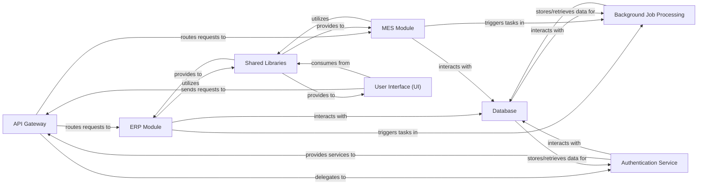

## Details

One paragraph explaining the functionality which is represented by this graph. What the main flow is and what is its purpose.

### API Gateway [[Expand]](./API_Gateway.md)
Handles API requests specifically related to accounting functionalities, including routing and initial validation for accounting-specific backend logic and services. It serves as the interface for accounting operations.

**Related Classes/Methods**:

- `lib/api/accounting.ts` (1:1)

### ERP Module
Manages core enterprise resource planning functionalities, including financial management, supply chain, and human resources. It encapsulates the business logic specific to ERP operations.

**Related Classes/Methods**:

- `apps/erp` (1:1)

### MES Module
Handles manufacturing execution system functionalities, overseeing production processes, quality control, and shop floor operations. It contains the business logic for manufacturing processes.

**Related Classes/Methods**:

- `apps/mes` (1:1)

### Database
The central data persistence layer, utilizing Supabase (PostgreSQL) for storing all application data, managing schemas, and enforcing row-level security (RLS).

**Related Classes/Methods**:

- `packages/database/supabase` (1:1)

### Authentication Service
Manages user authentication and authorization, leveraging Supabase Auth for user identity, session management, and role/attribute-based access control.

**Related Classes/Methods**:

- `packages/auth` (1:1)

### User Interface (UI)
The client-side application built with Remix, TypeScript, Tailwind CSS, and Radix UI, providing the interactive user experience for both ERP and MES functionalities.

**Related Classes/Methods**:

- `apps/web` (1:1)

### Background Job Processing
Handles asynchronous tasks, long-running operations, and event-driven workflows using Trigger.dev and Upstash (Redis) for queuing and execution, ensuring non-blocking operations.

**Related Classes/Methods**:

- `packages/jobs` (1:1)

### Shared Libraries
A collection of reusable code, common utilities, UI components, and shared types/interfaces that promote consistency and reduce duplication across different applications and services within the monorepo.

**Related Classes/Methods**:

- `packages/ui` (1:1)
- `packages/utils` (1:1)
- `packages/types` (1:1)

### [FAQ](https://github.com/CodeBoarding/GeneratedOnBoardings/tree/main?tab=readme-ov-file#faq)