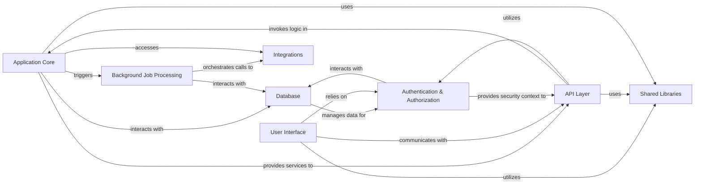

## Details

One paragraph explaining the functionality which is represented by this graph. What the main flow is and what is its purpose.

### Application Core
Encapsulates the primary business logic for manufacturing operations and enterprise resource planning, including core functionalities like order processing, inventory management, and production scheduling. This component is the heart of the system's domain-specific intelligence.

**Related Classes/Methods**:

- `packages/database/supabase/functions/` (1:1)

### API Layer
Serves as the primary interface for all client-server communication, handling incoming requests, routing them to the appropriate business logic in the Application Core, and orchestrating data flow. It enforces API contracts and security.

**Related Classes/Methods**:

- `apps/erp/app/routes/api+` (1:1)
- `apps/mes/app/routes/api+` (1:1)

### Database
The central data persistence layer, built on PostgreSQL and leveraging Supabase features for real-time capabilities, row-level security, and serverless functions. It stores all application data, including production orders, inventory, user profiles, and configuration.

**Related Classes/Methods**:

- `packages/database/supabase/` (1:1)

### Authentication & Authorization
Manages user identity, authentication (login, registration), and access control (Role-Based Access Control, Attribute-Based Access Control, Row-Level Security) using Supabase Auth. Ensures that only authorized users can access specific functionalities and data.

**Related Classes/Methods**:

- `packages/auth` (1:1)

### User Interface
The client-side application providing the interactive user experience for both ERP and MES functionalities. Built with Remix, TypeScript, Tailwind CSS, and Radix UI, it focuses on presenting data and capturing user input.

**Related Classes/Methods**:

- `apps/erp/app/` (1:1)
- `apps/mes/app/` (1:1)

### Background Job Processing
Handles asynchronous tasks, long-running operations, and event-driven workflows using Trigger.dev and Upstash (Redis). This offloads heavy computations and external communications from the main request-response cycle, improving responsiveness and scalability.

**Related Classes/Methods**:

- `packages/jobs/` (1:1)

### Shared Libraries
A collection of reusable code, including common UI components, utility functions, type definitions, and shared configurations. This component promotes code consistency, reduces redundancy, and facilitates independent development within the monorepo structure.

**Related Classes/Methods**:

- `packages/ui` (1:1)
- `packages/utils` (1:1)
- `packages/types` (1:1)

### Integrations
Manages connections and data exchange with external services and third-party APIs, such as Stripe for billing, Resend for email, and Novu for notifications. This component centralizes external communication logic.

**Related Classes/Methods**:

- `packages/integrations/` (1:1)

### [FAQ](https://github.com/CodeBoarding/GeneratedOnBoardings/tree/main?tab=readme-ov-file#faq)