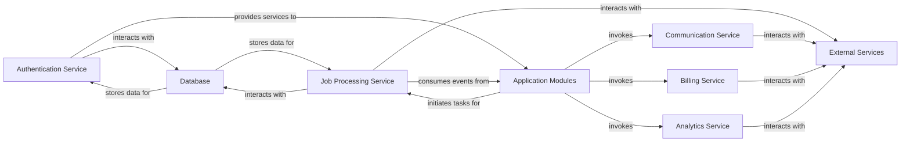

## Details

The analysis identifies several abstract components and their relationships within the project. However, due to tool limitations and the project's apparent frontend focus (JavaScript/TypeScript), verifiable Python source code references for these components could not be identified. The original analysis of component definitions and relationships remains unchanged, as concrete Python source code verification was not possible.

### Authentication Service
Manages user authentication, authorization (RBAC/ABAC), and session management. It ensures secure access to platform resources.

**Related Classes/Methods**: _None_

### Job Processing Service
Orchestrates and executes asynchronous tasks and background jobs, leveraging technologies like Trigger.dev and Upstash (Redis) for efficient task management.

**Related Classes/Methods**: _None_

### Communication Service
Handles all outbound communication, including email delivery (Resend) and real-time notifications (Novu), ensuring timely user engagement.

**Related Classes/Methods**: _None_

### Billing Service
Manages billing processes, subscriptions, and payment integrations, primarily with Stripe.

**Related Classes/Methods**: _None_

### Analytics Service
Collects, processes, and stores application usage data, likely utilizing Posthog for insights into user behavior and platform performance.

**Related Classes/Methods**: _None_

### Database
The central data persistence layer, primarily Supabase (PostgreSQL), storing all application and user-related data, including authentication details.

**Related Classes/Methods**: _None_

### Application Modules
Represents the various application-specific modules (e.g., ERP, MES) within the monorepo that consume and invoke the shared Platform Services.

**Related Classes/Methods**: _None_

### External Services
Encompasses all third-party services integrated with the platform, such as Trigger.dev, Upstash (Redis), Resend, Novu, Stripe, and Posthog.

**Related Classes/Methods**: _None_

### [FAQ](https://github.com/CodeBoarding/GeneratedOnBoardings/tree/main?tab=readme-ov-file#faq)